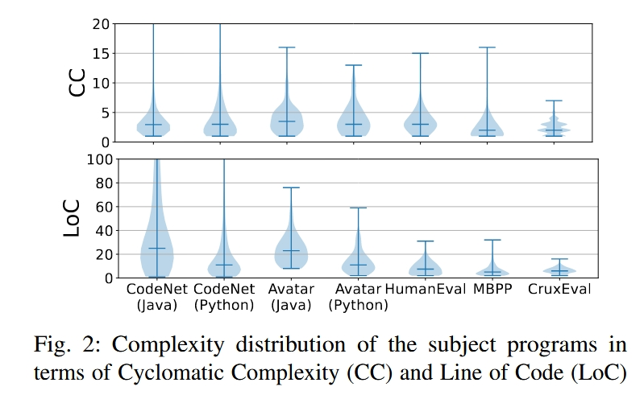
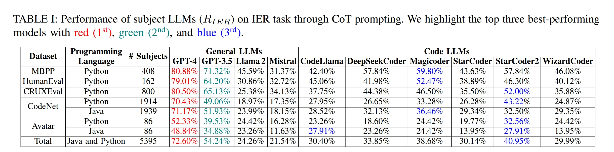
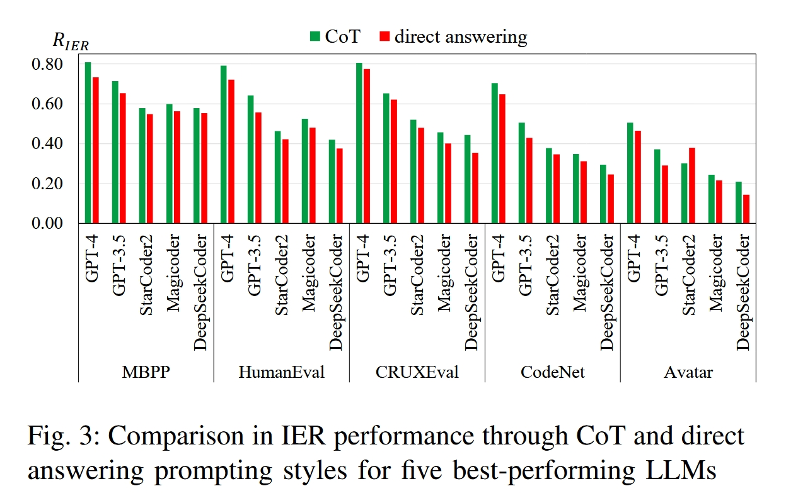
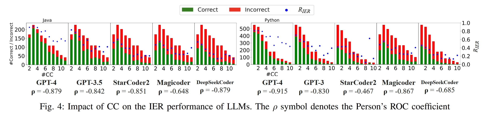
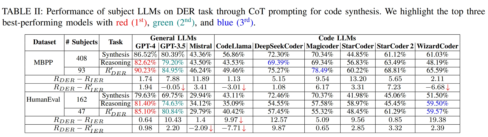
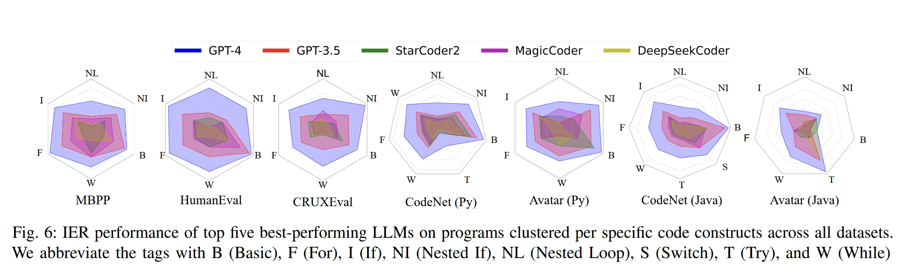
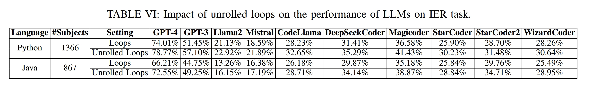
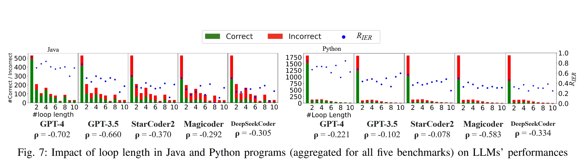
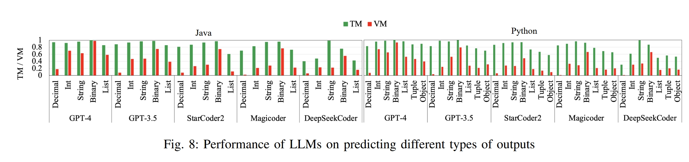

# CodeMind: A Framework to Challenge Large Language Models for Code Reasoning

> Univ. of Illinois at Urbana-Champaign[（UIUC：cs rank 2nd in the world during 10 years）](https://csrankings.org/#/index?all&world)
>
> [Changshu Liu](https://scholar.google.com/citations?user=cU2ynnIAAAAJ&hl=en)：电子科技大学（cd） - Columbia University - UIUC 
>
> 其有三篇工作，主要和代码分析相关的就是CodeMind和SarGaM（另一个是自监督图分析，天跨越好大）
>
> **CodeMind: A Framework to Challenge Large Language Models for Code Reasoning（2024/2写完的还没发出来，但是被引已经30了，感觉主要原因是和另一个UIUC的刘投的neurIps的工作[`EvalPlus`](https://arxiv.org/abs/2305.01210)相似度比较高）**
>
> 本质上就提出一个新的评估框架，之前评估LLMs的diamond能力，只考虑了代码生成能力，这里考虑评估：独立执行推理（IER）、依赖执行推理（DER）和规范推理（SR），前两种任务评估模型预测任意代码或模型可以正确合成的代码的执行输出的能力。第三种任务评估LLMs实现指定预期行为的程度。
>
> 其实就是一个评估LLMs的代码推理能力工具和框架。
>
> 我感觉对我们研究有作用的点一个是可以用于参考之后论文中result的设计、评估方法的设计。甚至可以直接import CondeMind评估。
>
> **Automated code editing with search-generate-modify**（发在了IEEE/ACM）
>
> 这个主要是提了SARGAM工具，提出一个混合方法（代码搜索、生成和修改）来更好地合成代码编辑 Bug fixing, Automated Program Repair, Editbased Neural Network
>
> **Is your code generated by chatgpt really correct? rigorous evaluation of large language models for code generation**
>
> 和CM很像，也是提出一个LLMs代码分析框架，但这篇写的更早，是2023/5写完的。
>
> 我怀疑他们是一个实验室的。
>
> 发在了NeurIps上，被引量900+
>
> 提出了更严格的代码合成评估框架；通过自动化方法大幅扩展测试用例（将HumanEval基准测试的测试用例扩展了80倍，创建了HumanEval+）
>
> 表明现有的代码合成评估结果不能准确反映LLMs的真实性能；开创了通过自动化测试改进编程基准的新方向；开源了工具、增强数据集和LLM生成的代码

[toc]

## Abstract

Abstract-Large Language Models (LLMs) have been widely used to automate programming tasks. Their capabilities have been evaluated by assessing code quality through test execution. However, as we will show, success in code synthesis does not imply code reasoning, which is essential to trust LLMs with tasks that involve program analysis, e.g., test generation and debugging. This paper introduces CodeMind, a framework designed to gauge the code reasoning abilities of LLMs through several inductive reasoning tasks. CodeMind currently supports three tasks: Independent Execution Reasoning (IER), Dependent Execution Reasoning (DER), and Specification Reasoning (SR). The first two evaluate models to predict the execution output of an arbitrary code or code the model could correctly synthesize. The third one evaluates LLMs' abilities to implement the specified expected behavior. Our extensive evaluation of ten LLMs across five benchmarks in two different programming languages for two code generation tasks (code synthesis and translation) using CodeMind shows that LLMs, to some degree, can explain the program execution flow, specifically for simple programs and the ones they can correctly generate. However, their performance drops for code with higher complexity, non-trivial logical and arithmetic operators, non-primitive types, and API calls. We observe that, while correlated, code generation abilities do not imply code reasoning: ranking LLMs based on test passing can be very different compared to code reasoning .

> 大型语言模型 (LLMs) 已广泛用于自动化编程任务。人们通过执行测试来评估代码质量，以此来评估它们的能力。然而，正如我们将要展示的，代码合成的成功并不意味着代码推理，而代码推理对于信任 LLMs 涉及程序分析的任务（例如测试生成和调试）至关重要。本文介绍了 CodeMind，这是一个旨在通过几个归纳推理任务来衡量 LLMs 的代码推理能力的框架。CodeMind 目前支持三项任务：独立执行推理 (IER)、依赖执行推理 (DER) 和规范推理 (SR)。前两个评估模型以预测任意代码或模型可以正确合成的代码的执行输出。第三个评估 LLMs 实现指定预期行为的能力。我们使用 CodeMind 对两种不同编程语言的五个基准测试中的十个 LLMs 进行了广泛的评估，这些测试针对两项代码生成任务（代码合成和翻译）。结果表明，LLMs 在一定程度上可以解释程序执行流程，特别是对于简单程序以及它们能够正确生成的程序。然而，对于复杂度较高、逻辑和算术运算符复杂、非原始类型复杂以及 API 调用复杂的代码，它们的性能会下降。我们观察到，虽然代码生成能力相互关联，但并不意味着代码推理能力：基于测试通过情况的 LLMs 排名与代码推理相比可能大相径庭。

## Introduction

Large Language Models (LLMs) have shown emerging abilities in code generation, specifically when instruction-tuned or prompted through Chain- or Tree-of-Thoughts  and in-context learning . However, several studies suggest that LLMs struggle to generalize this ability to real-world programs or to tasks that require understanding code logic rather than natural language . This is mainly because LLMs are trained to associate code synthesis with natural language specifications, i.e., combine code constructs similar to thousands to millions of examples they have seen while aligning to the requirements specified in the natural language. As a result, they intuitively have limited code reasoning to generalize to real-world problems or reliably perform broader program analysis tasks. While testing can validate the code LLMs generate, relying solely on test execution without assessing their abilities in code reasoning can be misleading.

> 大型语言模型（LLMs）在代码生成方面表现出新兴能力，特别是在经过指令调优或通过链式思维、树状思维和上下文学习提示时。然而，几项研究表明，LLMs难以将这种能力推广到真实世界的程序或需要理解代码逻辑而非自然语言的任务。这主要是因为LLMs被训练成将代码合成与自然语言规范关联起来，即结合他们所见过的成千上万甚至数百万示例中的代码结构，同时符合自然语言中指定的要求。因此，它们在代码推理方面的能力有限，难以推广到真实世界的问题或可靠地执行更广泛的程序分析任务。虽然测试可以验证代码LLMs的生成，但仅依赖测试执行而不评估其代码推理能力可能会产生误导。

To illustrate how code reasoning tasks better evaluate LLMs' abilities for coding, Figure 1-a shows a code synthesized by GPT-3.5 given a natural language specification. The code constructs corresponding to the concepts specified in natural language are highlighted with matching colors. Due to the ambiguity in the natural language, this code returns the smallest number in the list rather than the number at the index equal to the value of the smallest number. For a given input $[2,5,4,3]$, the code returns 2 instead of 4 , and the assertion fails.

> 为了说明代码推理任务如何更好地评估LLMs的编码能力，图 1-a 展示了 GPT-3.5 根据自然语言规范合成的代码。与自然语言中指定的概念对应的代码部分用匹配的颜色高亮显示。由于自然语言的歧义，该代码返回列表中的最小数字，而不是索引等于最小数字值的数字。对于给定输入$[2,5,4,3]$，代码返回 2 而不是 4，断言失败。


One way to relieve the inevitable natural language ambiguity and improve the performance of code generation tasks, e.g., code synthesis or translation, is including test data in the prompt . Figure 1-b shows the new specification and corresponding generated code. Executing the new code with the specified input-output pair (and additional test data) results in a test pass, implying a level of code reasoning, which we refer to as Specification Reasoning (SR). However, it is a weak proxy for code reasoning as it still involves the association of code and natural language. A stronger level of code reasoning is following how given inputs to the code evolve into output through execution, which we call Execution Reasoning (ER). This task challenges LLMs more in reasoning about code without natural language cross-reference. Figure 1-c shows the CoT reasoning of GPT-3.5 in response to the ER task . Even though the model previously generated this correct code itself (validated through testing), it cannot correctly reason how the same inputs evolve into output through code execution.

> 缓解不可避免的自然语言歧义并提升代码生成任务（如代码合成或翻译）性能的一种方法是在提示中包含测试数据。图 1-b 展示了新的规范及相应生成的代码。使用指定的输入输出对（以及额外的测试数据）执行新代码，结果通过测试，暗示了一定程度的代码推理，我们称之为规范推理（Specification Reasoning，SR）。然而，这只是代码推理的一个较弱代理，因为它仍涉及代码与自然语言的关联。更强的代码推理层次是通过执行跟踪给定输入如何演变为输出，我们称之为执行推理（Execution Reasoning，ER）。该任务在没有自然语言交叉引用的情况下，更加挑战LLMs的代码推理能力。图 1-c 展示了 GPT-3.5 对 ER 任务的链式推理（CoT reasoning）。尽管模型之前自己生成了正确代码（通过测试验证），但它无法正确推理相同输入如何通过代码执行演变为输出。


To advance the assessment of LLMs for programming tasks, this paper introduces CodeMind to enable code reasoning evaluation. CodeMind formally defines three inductive code reasoning tasks and metrics: Independent Execution Reasoning (IER) and Dependent Execution Reasoning (DER) assess if LLMs can reason about how given inputs evolve to output for any arbitrary code (IER) or only the code that they correctly generate (DER). Specification Reasoning (SR) evaluates the extent to which LLMs can reason and implement the specified behavior. CodeMind supports code reasoning for two most common generative tasks: code synthesis-generating code given natural language specification-and code translationgenerating code given another code in a different programming language as a specification.

> 为了推进对LLMs在编程任务中的评估，本文引入了 CodeMind 以实现代码推理评估。CodeMind 正式定义了三种归纳代码推理任务和指标：独立执行推理（IER）和依赖执行推理（DER）评估LLMs是否能够推理任意代码（IER）或仅对其正确生成的代码（DER）中给定输入如何演变为输出。规范推理（SR）评估LLMs推理和实现指定行为的能力。CodeMind 支持两种最常见的生成任务的代码推理：代码合成——根据自然语言规范生成代码——和代码翻译——根据另一种编程语言的代码作为规范生成代码。

Using CodeMind, we performed a large-scale study to assess state-of-the-art LLMs for code reasoning. We selected ten models, including both general-purpose and Code LLMs, and prompted them for IER, DER, and SR tasks on 5395 programs written in Java and Python. These programs are from five programming benchmarks, namely HumanEval , MBPP , CRUXEval  CodeNet , and Avatar . We observe that:

1. LLMs can explain the code statement by statement and often follow the execution flow. Yet, they fail to reason about output correctly, and their abilities are limited to simple programs. Open-source LLMs that have achieved comparable effectiveness as GPT models in code synthesis are behind them with a notable gap concerning code reasoning ($§$IV-A). In-depth analysis ($§$IV-D) suggests the root cause to be factors other than the difference in model size.
2. LLMs often achieve a higher performance reasoning about the code (with similar or even higher complexity) they can correctly synthesize or translate ($§$IV-B). This is potentially because synthesis/translation already enforces a level of inductive reasoning, making the execution reasoning less challenging.
3. LLMs , to a limited extent, can reason about test data in the specification, even if deceptive, and bring that into solving code synthesis and translation problems. Including test data helps code synthesis more than translation, likely due to ambiguity in natural language.
4. Depending on the complexity and specific properties of the programs or programming language, there could be $a$ (negative) negligible to no correlation between the ranking of models based on code synthesis/translation-generating a code that passes all tests-and code execution reasoning performance ($§$IV-B). This necessitates CodeMind tasks and metrics to complement the evaluation of LLMs for code.
5. Nested code constructs, complex conditional predicates and loop conditions, the non-trivial combination of arithmetic and logic operators, and API invocations can significantly challenge LLMs for code reasoning ($§$IV-D). Our experiments show that simplifying the code logic, e.g., unrolling the loops to eliminate the necessity of reasoning about loop conditions, can increase the code reasoning performance.

> 使用 CodeMind，我们进行了大规模研究以评估最先进的 LLMs 在代码推理中的表现。我们选择了十个模型，包括通用模型和代码 LLMs，并对它们在 5395 个用 Java 和 Python 编写的程序上进行了 IER、DER 和 SR 任务的测试。这些程序来自五个编程基准，分别是 HumanEval、MBPP、CRUXEval、CodeNet 和 Avatar。我们观察到：
>
> 1. LLMs 可以逐条解释代码语句，且通常能遵循执行流程。然而，它们在正确推理输出方面存在不足，且能力仅限于简单程序。开源的 LLMs 在代码合成方面已达到与 GPT 模型相当的效果，但在代码推理方面仍存在显著差距（$§$IV-A）。深入分析（$§$IV-D）表明，根本原因并非模型规模的差异。
> 2. LLMs 通常在推理代码（即使复杂度相似或更高）方面表现更好，它们能够正确合成或翻译代码（$§$IV-B）。这可能是因为合成/翻译本身已经强制执行了一定程度的归纳推理，使得执行推理的难度降低。
> 3. LLMs 在有限范围内，能够对规范中的测试数据进行推理，即使这些数据具有欺骗性，并将其应用于解决代码合成和翻译问题。包括测试数据对代码合成的帮助大于对翻译的帮助，这可能是由于自然语言中的歧义所致。
> 4. 根据程序或编程语言的复杂性和具体属性，基于代码合成/翻译生成通过所有测试的代码的模型排名与代码执行推理性能之间可能存在$a$（负向）微不足道甚至没有相关性（见§IV-B）。这就需要 CodeMind 任务和指标来补充对LLMs代码评估的不足。
> 5. 嵌套代码结构、复杂的条件谓词和循环条件、算术与逻辑运算符的非平凡组合以及 API 调用，都会显著挑战LLMs的代码推理能力（见§IV-D）。我们的实验表明，简化代码逻辑，例如展开循环以消除对循环条件推理的需求，可以提升代码推理性能。

Our contributions include (1) CodeMind framework for code reasoning, which is open-source and is designed so that other researchers can add reasoning tasks to it. (2) a large-scale evaluation of LLMs for code reasoning using CodeMind for two code generation tasks; and (3) a comprehensive, in-depth analysis of results that offers a catalog of root causes negatively impacting the abilities of LLMs for code reasoning .

> 我们的贡献包括（1）CodeMind 代码推理框架，开源设计，便于其他研究人员添加推理任务；（2）使用 CodeMind 对LLMs进行的大规模代码推理评估，涵盖两个代码生成任务；（3）对结果的全面深入分析，提供了影响LLMs代码推理能力的根本原因目录。

## CODEMIND

Program specification (either in natural language, code, or mathematical expressions) defines the logic that the code should implement. Formally speaking, it defines a function $S: S_I \rightarrow$ $S_O$, where $S_I$ is a set of all possible inputs to the program and $S_O$ is a set of corresponding outputs. A code synthesized based on the implementation is also a function $C: C_I \rightarrow C_O$. We define a program to be correct with respect to specification if it satisfies all the following conditions:

$$
C_I \subseteq S_I, C_O \subseteq S_O, \forall i \in C_I, C(i)=S(i)
$$

This entails the model to reason about how inputs evolve to a given output through implementation (execution reasoning), and implement the code such that it generates correct output for the given inputs (specification reasoning).

> 程序规范（可以是自然语言、代码或数学表达式）定义了代码应实现的逻辑。形式上，它定义了一个函数 $S: S_I \rightarrow S_O$，其中 $S_I$ 是程序所有可能输入的集合，$S_O$ 是对应输出的集合。基于实现合成的代码也是一个函数 $C: C_I \rightarrow C_O$。如果程序满足以下所有条件，我们称该程序相对于规范是正确的：
>
> $
> C_I \subseteq S_I, C_O \subseteq S_O, \forall i \in C_I, C(i)=S(i)
> $
>
> 这要求模型推理输入如何通过实现（执行推理）演变为给定输出，并实现代码以便为给定输入生成正确的输出（规范推理）。

### A. Execution Reasoning 执行推理

Considering the formalization mentioned above, we define two execution reasoning tasks as follows.

**Definition 1: Independent Execution Reasoning (IER)**. Given a program $C: C_I \rightarrow C_O$ and set of inputs $\hat{I}=\left\{i \mid i \in C_I\right\}$, LLM $L$ can correctly reason about code execution if $\hat{o}=C(\hat{I})$, where $\hat{o}=L(\hat{I})$ is the predicted output by $L$. Note that in this task, we do not deal with specification, so we can assess LLMs for any arbitrary code with ground-truth pairs of $\langle\hat{I}, \hat{o}\rangle$.

IER evaluates LLMs for general inductive code reasoning, which requires knowing different code constructs, arithmetic and logic operations, and programming language properties. However, even for human developers, reasoning about their developed code is easier than any arbitrary code. Furthermore, as a self-consistency [8] measurement, LLMs should be able to reason about the code they can correctly synthesize. This demands the following execution reasoning task:

**Definition 2: Dependent Execution Reasoning (DER)**. Given a specification $S: S_I \rightarrow S_O$, a program $C: C_I \rightarrow C_O$ generated by LLM $L$, and set of inputs $\hat{I}=\left\{i \mid i \in C_I, C(i)=\right.$ $S(i)\}$, LLM $L$ can correctly reason about code execution if $\hat{o}=C(\hat{I})$, where $\hat{o}=L(\hat{I})$ is the predicted output by $L$. The assumption here is that when LLM $L$ generates code $C$ that passes the test $\langle\hat{I}, \hat{o}\rangle$, it should be able to predict $\hat{o}$ correctly.

> 考虑到上述形式化，我们定义了两个执行推理任务如下。
>
> **定义 1：独立执行推理（IER）**。给定一个程序 $C: C_I \rightarrow C_O$ 和输入集合 $\hat{I}=\left\{i \mid i \in C_I\right\}$，LLM 如果 $\hat{o}=C(\hat{I})$，其中 $\hat{o}=L(\hat{I})$ 是 $L$ 预测的输出，则 $L$ 可以正确地推理代码执行。注意，在此任务中，我们不处理规范，因此可以针对任何具有真实输入输出对 $\langle\hat{I}, \hat{o}\rangle$ 的任意代码评估 LLMs。
>
> IER 评估 LLMs 用于一般的归纳代码推理，这需要了解不同的代码结构、算术和逻辑操作以及编程语言属性。然而，即使对于人类开发者来说，推理他们自己开发的代码也比任意代码更容易。此外，作为一种自洽性[8]的度量，LLMs 应该能够推理他们能够正确合成的代码。这就要求以下执行推理任务：
>
> **定义 2：依赖执行推理（DER）**。给定规范 $S: S_I \rightarrow S_O$，由 LLM $L$ 生成的程序 $C: C_I \rightarrow C_O$，以及输入集合 $\hat{I}=\left\{i \mid i \in C_I, C(i)= S(i)\right\}$，如果 $\hat{o}=C(\hat{I})$，其中 $\hat{o}=L(\hat{I})$ 是 $L$ 预测的输出，则 LLM $L$ 可以正确地推理代码执行。这里的假设是，当 LLM $L$ 生成通过测试 $\langle\hat{I}, \hat{o}\rangle$ 的代码 $C$ 时，它应该能够正确预测 $\hat{o}$。

### B. Specification Reasoning 规范推理

In addition to execution reasoning, a model should understand specifications to synthesize the correct code. This specification can be given through natural language (in code synthesis) or programming language (in code translation). To evaluate if LLMs truly reason about the specification and not generate a probabilistic guess, we measure how including test data in the specification helps the model generate the correct code. Regardless of the type of specification, we define the specification reasoning task as follows.

**Definition 3: Specification Reasoning (SR).** Given a specification $S: S_I \rightarrow S_O$ in natural language or programming language, an arbitrary test $t=\langle i, o\rangle$, where $i \in S_I, o \in S_O, S(i)=o$, program $C_S: C_{S_I} \rightarrow C_{S_O}$ (generated by LLM $L$ given the specification $S$ ), and program $C_{S+t}: C_{S+t_I} \rightarrow C_{S+t_O}$ (generated by LLM $L$ given the specification $S$ and $t$ ), the LLM can correctly reason about specification if $C_{S+t}(i)=o \quad \& \quad C_S(i) \neq o$. In other words, LLM $L$ should be able to pass a test with $\langle i, o\rangle$ when they are explicitly specified in the prompt but fail it otherwise. This shows that the model has not just overfitted into the specification but can reason about it.

> 除了执行推理，模型还应理解规范以合成正确的代码。该规范可以通过自然语言（在代码合成中）或编程语言（在代码翻译中）给出。为了评估LLMs是否真正推理规范而非生成概率性猜测，我们测量在规范中包含测试数据如何帮助模型生成正确代码。无论规范类型如何，我们将规范推理任务定义如下。
>
> **定义 3：规范推理（SR）。** 给定一个规范 $S: S_I \rightarrow S_O$，以自然语言或编程语言表示，一个任意测试 $t=\langle i, o\rangle$，其中 $i \in S_I, o \in S_O, S(i)=o$，程序 $C_S: C_{S_I} \rightarrow C_{S_O}$（由 LLM $L$ 根据规范 $S$ 生成），以及程序 $C_{S+t}: C_{S+t_I} \rightarrow C_{S+t_O}$（由 LLM $L$ 根据规范 $S$ 和测试 $t$ 生成），如果 $C_{S+t}(i)=o \quad \& \quad C_S(i) \neq o$，则 LLM 可以正确地进行规范推理。换句话说，LLM $L$ 应该能够在提示中明确指定 $\langle i, o\rangle$ 时通过该测试，否则则不通过。这表明模型不仅仅是对规范进行了过拟合，而是能够对其进行推理。

### C. Evaluating Code Reasoning 评估代码推理

1. Evaluating Execution Reasoning

Evaluating Execution Reasoning: We measure the performance of a model $L$ in execution reasoning for a given program $C$ with inputs $\hat{I}$ using the Execution Reasoning Score ( $S_{E R}$ ) as below:
$$
S_{E R}(L, C, \hat{I})= \begin{cases}1, & \text { if } L(\hat{I})=C(\hat{I}) \\ 0, & \text { otherwise }\end{cases}\tag{1}
$$

which is 1 if the model can correctly predict the expected output and 0 otherwise. Given that IER is measured on any arbitrary code, $S_{I E R}=S_{E R}$. For DER, however, the reasoning is conditioned to the code correctness (Definition 2). As a result, we define $S_{D E R}$ as below:

$$
S_{D E R}(L, C, \hat{I})=\operatorname{Pass}_{\langle L, C, \hat{I}\rangle} \times S_{E R}(L, C, \hat{I})\tag{2}
$$

where $\operatorname{Pass}_{\langle L, C, \hat{I}\rangle}$ denotes test result: 1 if the generated code $C$ by the LLM $L$ passes the tests with inputs $\hat{I}$ and 0 , otherwise. We also introduce the Execution Reasoning Rate ( $R_{E R}$ ) metric, a collective metric that measures how much a given LLM $L$ can reason about multiple programs in a benchmark. We calculate $R_{E R}$ for a set of $m$ programs in benchmark $B$ as:

$$
R_{E R}(L, B)=\frac{\sum_{i=1}^m [\![ S_{E R}\left(L, C_i \in B\right)=1 ]\!]}{m}\tag{3}
$$

where $[\![  \cdots]\!]$ denote the Iverson bracket: it returns 1 if the condition in square brackets is satisfied and 0 otherwise. We compute $R_{I E R}=R_{E R}$ and $R_{D E R}$ as:

$$
R_{D E R}(L, B)=\frac{\sum_{i=1}^m [\![ S_{D E R}\left(L, C_i \in B, \hat{I}_i\right)=1 ]\!]}{m}\tag{4}
$$

> 1. 评估执行推理
>
> 评估执行推理：我们使用执行推理得分（$S_{E R}$）来衡量模型$L$在给定程序$C$及输入$\hat{I}$上的执行推理性能，计算方式如下：
> $$
> S_{E R}(L, C, \hat{I})= \begin{cases}1, & \text { if } L(\hat{I})=C(\hat{I}) \\ 0, & \text { otherwise }\end{cases}\tag{1}
> $$
> 当模型能正确预测预期输出时得分为 1，否则为 0。鉴于 IER 是在任意代码上测量的，故$S_{I E R}=S_{E R}$。然而，对于 DER，推理是以代码正确性为条件（定义 2）。因此，我们定义$S_{D E R}$如下：
> $$
> S_{D E R}(L, C, \hat{I})=\operatorname{Pass}_{\langle L, C, \hat{I}\rangle} \times S_{E R}(L, C, \hat{I})\tag{2}
> $$
> 其中，$\operatorname{Pass}_{\langle L, C, \hat{I}\rangle}$ 表示测试结果：如果由 LLM $L$ 生成的代码 $C$ 在输入 $\hat{I}$ 下通过测试，则为 1，否则为 0。我们还引入了执行推理率（$R_{E R}$）指标，这是一个综合指标，用于衡量给定的 LLM $L$ 在基准测试中对多个程序的推理能力。我们计算基准测试 $B$ 中 $m$ 个程序的 $R_{E R}$ 如下：
> $$
> R_{E R}(L, B)=\frac{\sum_{i=1}^m [\![ S_{E R}\left(L, C_i \in B\right)=1 ]\!]}{m}\tag{3}
> $$
> 其中，$[\![  \cdots]\!]$ 表示伊夫森括号：如果方括号内的条件成立，则返回 1，否则返回 0。我们计算 $R_{I E R}=R_{E R}$ 和 $R_{D E R}$ 如下：
> $$
> R_{D E R}(L, B)=\frac{\sum_{i=1}^m [\![ S_{D E R}\left(L, C_i \in B, \hat{I}_i\right)=1 ]\!]}{m}\tag{4}
> $$

2) Evaluating Specification Reasoning

Evaluating Specification Reasoning: We measure the performance of a model $L$ in specification reasoning using $S_{S R}$ as below:
$$
S_{S R}(L, S, t)=\left(1-\text { Pass }_{\left\langle L, C_S, t\right\rangle}\right) \times \operatorname{Pass}_{\left\langle L, C_{S+t}, t\right\rangle}\tag{5}
$$

$S_{S R}$ is a conservative metric that rules out cases where LLMs only generate a correct code based on the natural language or programming language specification. However, given the possibility of data contamination, we need such a conservative metric as a lower bound for the reasoning abilities of LLMs. Similar to execution reasoning, we calculate the collective $R_{S R}$ values for a set of $m$ programs in benchmark $B$ as:

$$
R_{S R}(L, B)=\frac{\sum_{i=1}^m [\![ S_{S R}\left(L, S_i \in B, t_i\right)=1 ]\!]}{m}\tag{6}
$$

> 2) 评估规范推理
>
> 评估规范推理：我们使用以下公式 $S_{S R}$ 来衡量模型 $L$ 在规范推理中的表现：
> $$
> S_{S R}(L, S, t)=\left(1-\text { Pass }_{\left\langle L, C_S, t\right\rangle}\right) \times \operatorname{Pass}_{\left\langle L, C_{S+t}, t\right\rangle}
> $$
> $S_{S R}$ 是一个保守的指标，用于排除 LLMs 仅基于自然语言或编程语言规范生成正确代码的情况。然而，鉴于数据污染的可能性，我们需要这样一个保守的指标作为 LLMs 推理能力的下界。类似于执行推理，我们计算基准测试集 $B$ 中 $m$ 个程序的整体 $R_{S R}$ 值，公式如下：
> $$
> R_{S R}(L, B)=\frac{\sum_{i=1}^m [\![ S_{S R}\left(L, S_i \in B, t_i\right)=1 ]\!]}{m}\tag{6}
> $$

## EXPERIMENTAL SETUP

Our study includes ten LLMs and 5395 programs in Java and Python from five programming datasets. We explain the details of LLMs and program selection below.

> 我们的研究包括来自五个编程数据集的十个LLMs和 5395 个 Java 和 Python 程序。我们将在下文解释LLMs和程序选择的详细信息。

**Subject LLMs.** We chose ten pre-trained or instructiontuned models, covering both general-purpose and Code LLMs. Our choice was limited to computing resources, so we selected models with less than 20B parameters that outperform the rest for programming tasks. Our subject LLMs are GPT4 , GPT-3.5 , Llama 2 (13B) , Mistral , CodeLlama (13B, instruction-tuned) , StarCoder (15.5B) , StarCoder 2 (15B), WizardCoder (15B, instruction-tuned) , Magicoder (7B)  (instruction-tuned), DeepSeekCoder (6.7B) . We followed the best practices and customized the prompt templates per each model (all prompts are publicly available for further investigation ). Except for the GPT models, we set the temperature to zero to ensure the reproducibility of the results. Our code is open-source to users for using CodeMind for other models and temperatures.

> **LLMs** 我们选择了十个预训练或指令调优模型，涵盖通用和代码 LLMs。由于计算资源有限，我们选择了参数少于 200 亿且在编程任务中表现优于其他模型的模型。我们的主题 LLMs 包括 GPT4、GPT-3.5、Llama 2（13B）、Mistral、CodeLlama（13B，指令调优）、StarCoder（15.5B）、StarCoder 2（15B）、WizardCoder（15B，指令调优）、Magicoder（7B，指令调优）、DeepSeekCoder（6.7B）。我们遵循最佳实践，并为每个模型定制了提示模板（所有提示均公开以供进一步研究）。除 GPT 模型外，我们将温度设置为零以确保结果的可复现性。我们的代码是开源的，供用户使用 CodeMind 进行其他模型和温度的测试。

**Subject Programs.** Our criteria for selecting subject programs were the existence of test data (inputs and corresponding expected output) and implementations of the same program in multiple programming languages (to investigate its impact on code reasoning). From several existing benchmarks , we chose the programs in HumanEval , MBPP , CodeNet , Avatar , and CRUXEval . We chose Java and Python versions of the programs as they are more prominently used programming languages. HumanEval and MBPP are well-known benchmarks for code synthesis. CodeNet and Avatar are code translation benchmarks. CRUXEval is a benchmark of relatively simple Python programs generated by CodeLlama (34B) to evaluate input prediction and output prediction of LLMs. Since the code in CodeNet and Avatar takes inputs interactively from the console, we only consider those with single-line input to eliminate the difficulty of understanding the input for LLMs and its impact on the code reasoning.

> **程序** 我们选择主题程序的标准是存在测试数据（输入和对应的预期输出）以及同一程序在多种编程语言中的实现（以研究其对代码推理的影响）。从多个现有基准中，我们选择了 HumanEval、MBPP、CodeNet、Avatar 和 CRUXEval 中的程序。我们选择了程序的 Java 和 Python 版本，因为它们是更常用的编程语言。HumanEval 和 MBPP 是著名的代码合成基准。CodeNet 和 Avatar 是代码翻译基准。CRUXEval 是由 CodeLlama (34B) 生成的相对简单的 Python 程序基准，用于评估 LLMs 的输入预测和输出预测。由于 CodeNet 和 Avatar 中的代码从控制台交互式获取输入，我们仅考虑单行输入的程序，以消除理解 LLMs 输入的难度及其对代码推理的影响。

Figure 2 shows the complexity distribution of the programs in terms of Cyclomatic Complexity (CC) , and Lines of Code (LoC). CC measures the independent execution paths in the program control flow graph (CFG). We calculate CC as $C C=E-N+2 P$, where $E$ and $N$ are the number of edges and nodes in the CFG, respectively, and $P$ is the number of methods when we measure CC in for class. For code reasoning, the higher the number of independent paths, the more challenging it is for the model to succeed by chance.

> 图 2 显示了程序在圈复杂度（Cyclomatic Complexity，CC）和代码行数（Lines of Code，LoC）方面的复杂度分布。CC 衡量程序控制流图（CFG）中的独立执行路径数。我们计算 CC 的公式为 $CC=E-N+2P$，其中 $E$ 和 $N$ 分别是 CFG 中的边数和节点数，$P$ 是在类中测量 CC 时的方法数量。对于代码推理，独立路径数越多，模型凭运气成功的难度越大。



## RESULTS AND ANALYSIS

In this section, we evaluate LLMs' performance in IER (RQ1), DER (RQ2), and SR (RQ3), and investigate possible factors affecting their reasoning on code execution (RQ4).

> 在本节中，我们评估了LLMs在 IER（RQ1）、DER（RQ2）和 SR（RQ3）中的表现，并探讨了可能影响其代码执行推理的因素（RQ4）。

### A. RQ1 - LLMs’ Performance in IER

To evaluate the performance of LLMs on the IER task, we promoted them under two settings: direct answering and CoT. For direct answering, we prompted each model to predict the output for the given input(s). Under the CoT setup, we first instruct the model to simulate the execution step by step and reason about the output value after the execution of each statement. We then ask it to predict the output for the given input at the end of execution. In both settings, the prompt contains one in-context example for two purposes: introducing the IER task and instructing the response formatting. Details about CoT and direct answering prompts can be found in our artifact website . We set the temperature to 0 for the sake of reproducibility of our results.

> 为了评估LLMs在 IER 任务上的表现，我们在两种设置下对其进行了测试：直接回答和链式思维（CoT）。对于直接回答，我们提示每个模型预测给定输入的输出。在链式思维设置下，我们首先指示模型逐步模拟执行过程，并在执行每条语句后推理输出值。然后，我们要求模型在执行结束时预测给定输入的输出。在这两种设置中，提示中都包含一个上下文示例，目的是介绍 IER 任务并指导响应格式。关于链式思维和直接回答提示的详细信息可以在我们的成果网站上找到。为了结果的可复现性，我们将温度设置为 0。

Given that IER only requires an arbitrary code and corresponding ground-truth pair of $\langle\hat{I}, \hat{o}\rangle$ (§II-A), we prompted the LLMs using all 5395 subject programs in this experiment. Table I and Figure 3 show the result of this experiment through CoT and direct-answering prompting. GPT models outperform others on the IER task, with large margins of $31.65 \%$ (GPT4) and $13.29 \%$ (GPT-3.5) from the best open-source model, StarCoder 2. Detailed observations include:

> 鉴于 IER 仅需要一个任意代码及对应的真实标签对$\langle\hat{I}, \hat{o}\rangle$（§II-A），我们在本实验中使用所有 5395 个主题程序对LLMs进行了提示。表 I 和图 3 展示了通过 CoT 和直接回答提示进行的实验结果。GPT 模型在 IER 任务上表现优于其他模型，领先最佳开源模型 StarCoder 2 达$31.65\%$（GPT4）和$13.29\%$（GPT-3.5）。具体观察包括：





- On CodeNet and Avatar with equivalent logic implemented in two programming languages, we observe no persistent gain or drop in $R_{I E R}$ from one language to another across studied LLMs. One-tail t-tests over the $E_{I E R}$ values show no statically significant dominance for any programming language ( $p$-value $=0.3$ for Python dominance hypothesis and $p$-value $=0.7$ for Java dominance hypothesis with $\alpha=0.05$ ).

  > 在 CodeNet 和 Avatar 中，使用两种编程语言实现等效逻辑，我们观察到在所研究的LLMs中，从一种语言到另一种语言的$R_{I E R}$没有持续的增益或下降。对$E_{I E R}$值进行单尾 t 检验显示没有任何编程语言具有统计学上的显著优势（Python 优势假设的$p$值为 0.3，Java 优势假设的$p$值为 0.7，显著性水平$\alpha=0.05$）。

- Moving down in the table, the $R_{I E R}$ values drop, i.e., execution reasoning on CodeNet and Avatar programs is harder, compared to MBPP, HumanEval, and CRUXEval. One potential reason is the varying complexity between the datasets and a strong negative correlation (measured by Spearman's Rank Order Correlation (ROC) ) between CC and $R_{I E R}$ values (Figure 4). At the same time, some models achieve a lower performance on CRUXEval compared to HumanEval, whose programs are more complex regarding both LoC and CC . Also, despite having similar CC distribution, models struggle more on the Avatar compared to CodeNet. This entails a better understanding of what factors other than CC impact the $R_{I E R}$ performance of the models (§IV-D). In other words, the notion of program complexity for LLMs could be different and, thereby, should be measured differently than classic complexity metrics.

  > 在表格中向下移动，$R_{I E R}$ 值下降，即与 MBPP、HumanEval 和 CRUXEval 相比，CodeNet 和 Avatar 程序的执行推理更难。一个潜在原因是数据集之间复杂度的差异，以及 CC 与 $R_{I E R}$ 值之间的强负相关（通过 Spearman 等级相关系数（ROC）测量）（图 4）。同时，一些模型在 CRUXEval 上的表现低于 HumanEval，而后者的程序在代码行数（LoC）和圈复杂度（CC）方面更复杂。此外，尽管 CC 分布相似，模型在 Avatar 上的表现仍比在 CodeNet 上更差。这表明除了 CC 之外，还有其他因素影响模型的 $R_{I E R}$ 性能（§IV-D）。换句话说，LLMs 的程序复杂度概念可能不同，因此应采用不同于经典复杂度指标的方式进行衡量。

  

- Compared to direct answering, CoT-style prompting improves the performance of LLMs on IER by $5.07 \%$ on average across all the benchmarks and LLMs. GPT models benefit more from CoT, likely due to their better and more rigorous alignment in thinking step by step. They also benefit from the natural language explanation they produce as feedback for the next step .

  > 与直接回答相比，CoT 风格的提示使 LLMs 在 IER 上的表现平均提升了 5.07%，涵盖所有基准测试和 LLMs。GPT 模型从 CoT 中受益更多，可能是因为它们在逐步思考时具有更好且更严谨的对齐。它们还受益于所生成的自然语言解释，作为下一步的反馈。

### B. RQ2 - LLMs' Performance in DER

We seek to address the critical question of how effectively the model can correctly reason about the correct programs it has generated through code synthesis or translation. This requires us to align code synthesis/translation and reasoning tasks. DER evaluation consists of three steps: (1) following the best practices, CodeMind prompts LLMs for code synthesis or translation; (2) it executes the generated program against existing tests; and (3) for the programs with tests pass, it prompts the model using CoT style for code execution reasoning using one of the test inputs.

> 我们旨在解决一个关键问题，即模型通过代码合成或翻译生成的正确程序能多有效地进行正确推理。这要求我们将代码合成/翻译与推理任务对齐。DER 评估包括三个步骤：（1）遵循最佳实践，CodeMind 使用 LLMs 进行代码合成或翻译提示；（2）对生成的程序执行现有测试；（3）对于测试通过的程序，使用 CoT 风格基于其中一个测试输入提示模型进行代码执行推理。

We performed code synthesis on MBPP and HumanEval, as the other three datasets are not designed for code synthesis and lack proper natural language specifications. For code translation, we used CodeNet and Avatar, as they have ground-truth translations in both Java and Python programming languages. Furthermore, their test data can be reused to validate the code generated in both languages without inaccuracies potentially involved in test translation . We excluded Llama 2 from this experiment as we could not reproduce their code synthesis results. We also removed the comments from the LLMgenerated codes to ensure they do not impact the code reasoning. Similar to IER, we set the temperature to zero to account for the non-determinism and reproducibility of the results. Consequently, our synthesis and translation results might be different from existing leaderboards or published research .

> 我们在 MBPP 和 HumanEval 上进行了代码合成，因为其他三个数据集并非为代码合成设计，且缺乏适当的自然语言规范。对于代码翻译，我们使用了 CodeNet 和 Avatar，因为它们在 Java 和 Python 编程语言中都有真实的翻译。此外，它们的测试数据可以重复使用，以验证两种语言生成的代码，而不会涉及测试翻译中可能存在的不准确性。我们将 Llama 2 排除在本次实验之外，因为我们无法复现其代码合成结果。我们还从 LLM 生成的代码中移除了注释，以确保它们不会影响代码推理。与 IER 类似，我们将温度设置为零，以考虑结果的非确定性和可重复性。因此，我们的合成和翻译结果可能与现有排行榜或已发布的研究有所不同。

Tables II-III present the results of DER on code synthesis and translation. In Table II, Synthesis rows show the percentage of programs in each dataset that models correctly synthesized, i.e., generated code passed all existing tests. In Table III, Translation rows show the percentage of programs in each dataset for a programming language pair that models were about to correctly translate, i.e., generated code passed all existing tests. The Reasoning rows in these two tables demonstrate the $R_{D E R}$ values (Equation 4). GPT models still outperform open-source models on the DER task, with a margin of $17.03 \%$ (GPT-4) and $12.50 \%$ (GPT-3.5) in code synthesis and $27.37 \%$ (GPT4) and $13.55 \%$ (GPT-3.5) in code translation, from the best open-source model.

> 表 II-III 展示了代码合成和翻译任务上的 DER 结果。在表 II 中，Synthesis 行显示了每个数据集中模型正确合成的程序百分比，即生成的代码通过了所有现有测试。在表 III 中，Translation 行显示了每个数据集中针对编程语言对模型能够正确翻译的程序百分比，即生成的代码通过了所有现有测试。这两张表中的 Reasoning 行展示了 $R_{D E R}$ 值（公式 4）。GPT 模型在 DER 任务上仍然优于开源模型，代码合成方面，GPT-4 和 GPT-3.5 分别比最佳开源模型高出 $17.03\%$ 和 $12.50\%$，代码翻译方面，GPT-4 和 GPT-3.5 分别高出 $27.37\%$ 和 $13.55\%$。




DER depends on successful code generation, causing different values for the denominator of Equation 4 across models. To ensure this does not threaten the validity of our conclusions, we also computed $R_{D E R}^{\prime}$ on the overlap between correctly generated code across all LLMs. In code translation, we excluded StarCoder and WizardCoder due to their poor performance. While $R_{D E R}^{\prime}$ values are higher than $R_{D E R}$ due to a smaller denominator, the ranking between the models in code reasoning remains almost the same.

> DER 依赖于成功的代码生成，导致方程 4 的分母在不同模型中取值不同。为了确保这不会影响我们结论的有效性，我们还计算了所有 LLMs 中正确生成代码的重叠部分上的 $R_{D E R}^{\prime}$。在代码翻译中，由于表现不佳，我们排除了 StarCoder 和 WizardCoder。虽然由于分母较小，$R_{D E R}^{\prime}$ 的值高于 $R_{D E R}$，但代码推理中模型之间的排名几乎保持不变。

Models achieve higher $R_{D E R}$ compared to $R_{I E R}$ (from Table I) in both synthesis ( $7.51 \%$ higher) and translation ( $10.28 \%$ higher). We performed another controlled experiment and calculated $R_{I E R}^{\prime}$, accumulated on $S_{I E R}$ of the ground-truth code for the programs that LLMs achieved $S_{D E R}=1$. New experiments show that, except in a few cases, the $R_{D E R}$ values are still higher than $R_{I E R}^{\prime}$, but with a lower improvement of $1.47 \%$ for synthesis and $6.32 \%$ for translation.

> 模型在合成（高出 7.51%）和翻译（高出 10.28%）中，相较于$R_{I E R}$（见表 I）实现了更高的$R_{D E R}$。我们进行了另一项对照实验，计算了$R_{I E R}^{\prime}$，该值累积于程序的真实代码的$S_{I E R}$，这些程序中LLMs达到了$S_{D E R}=1$。新的实验表明，除少数情况外，$R_{D E R}$值仍然高于$R_{I E R}^{\prime}$，但合成的提升降低至 1.47%，翻译的提升降低至 6.32%。


Before concluding that the models are more competent in execution reasoning when evaluated on the programs they correctly generate, we investigated whether LLM-generated programs are similar to original ground-truth codes in IER. Figure 5 shows the CC distribution of the programs in MBPP, HumanEval, CodeNet, and Avatar, compared to that generated by subject LLMs. We can observe that the synthesized/translated code, if not more complex, is no less than the ground-truth code in these datasets. CC is only a proxy, and other factors may impact the reasoning of models. However, a consistent and intuitive negative correlation between reasoning abilities and CC across LLMs increases its impact size. Consequently, we confirm that models reason better on code they correctly generate. However, there is still a considerable gap between the LLM's code synthesis and reasoning abilities, specifically on open-source models.

> 在得出模型在正确生成的程序上执行推理能力更强的结论之前，我们调查了LLM生成的程序是否与 IER 中的原始真实代码相似。图 5 显示了 MBPP、HumanEval、CodeNet 和 Avatar 中程序的 CC 分布，并与受试者LLMs生成的程序进行了比较。我们可以观察到，合成/翻译的代码如果不是更复杂，也不比这些数据集中的真实代码简单。CC 只是一个代理指标，其他因素可能影响模型的推理能力。然而，推理能力与 CC 之间在LLMs上的一致且直观的负相关关系增加了其影响力度。因此，我们确认模型在正确生成的代码上推理能力更强。然而，LLM的代码合成与推理能力之间仍存在相当大的差距，特别是在开源模型上。


Given that code generation and reasoning are unified in DER, we first computed the Spearman's ROC between the rank of models based on their performance in synthesis/translation and reasoning for each dataset. The results show a strong positive correlation on MBPP $(\rho=0.79)$, a negligible negative correlation on HumanEval ( $\rho=-0.11$ ), strong correlation on CodeNet (Java to Python $\rho=0.54$ ), weak negative correlation on CodeNet (Python to Java $\rho=-0.25$ ), negligible negative correlation on Avatar (Java to Python $\rho=-0.18$ ), and strong correlation on Avatar (Python to Java $\rho=0.59$ ).

> 鉴于代码生成和推理在 DER 中是统一的，我们首先计算了基于合成/翻译和推理性能对模型排名的斯皮尔曼 ROC 在每个数据集上的相关性。结果显示 MBPP 上有强正相关（$\rho=0.79$），HumanEval 上有可忽略的负相关（$\rho=-0.11$），CodeNet（Java 到 Python）上有强相关（$\rho=0.54$），CodeNet（Python 到 Java）上有弱负相关（$\rho=-0.25$），Avatar（Java 到 Python）上有可忽略的负相关（$\rho=-0.18$），Avatar（Python 到 Java）上有强相关（$\rho=0.59$）。

These results communicate a strong message: the ranking of LLMs based on their code generation abilities and test passes could be different from that based on code reasoning. Models may overfit widely used datasets such as HumanEval, giving a false promise on the abilities of LLMs for programming. This necessitates a framework such as CodeMind to promote other evaluation aspects of Code LLMs as well as the need for more diverse and contamination-free evaluation datasets.

> 这些结果传达了一个强烈的信息：基于代码生成能力和测试通过情况对LLMs的排名可能与基于代码推理的排名不同。模型可能会对广泛使用的数据集如 HumanEval 过拟合，从而对LLMs的编程能力产生虚假的承诺。这就需要像 CodeMind 这样的框架来促进 Code LLMs的其他评估方面，以及需要更多多样化且无污染的评估数据集。

### C. RQ3. LLMs' Performance in SR

Specification Reasoning (SR) offers a novel perspective in understanding the code generation process of LLMs, particularly about how they leverage input-output pairs in the specifications for code generation. To evaluate the abilities of LLMs for SR, we prompted LLMs for code synthesis and translation under the following three settings:

> 规范推理（SR）为理解LLMs的代码生成过程提供了一种新视角，特别是关于它们如何利用规范中的输入输出对进行代码生成。为了评估LLMs在 SR 方面的能力，我们在以下三种设置下提示LLMs进行代码合成和翻译：

(1) Natural language specification with one ground-truth input-output (With Test). Under this setting, we randomly select and add one of the existing tests to the specification. We validate the synthesized code using only this test.

> (1) 使用一个真实输入输出的自然语言规范（带测试）。在此设置下，我们随机选择并添加一个现有测试到规范中。我们仅使用该测试验证合成的代码。

(2) Natural language specification with no input-output (No Test). We remove the test added to the specification in the previous setting and re-prompt LLMs for code generation. We validate the synthesized code using only the test from the previous setting. Intuitively, if including test data helps LLMs in code synthesis, we observe a drop in LLMs' performance.

> (2) 无输入输出的自然语言规范（无测试）。我们移除前一设置中添加到规范的测试，并重新提示LLMs进行代码生成。我们仅使用前一设置中的测试来验证合成的代码。直观上，如果包含测试数据有助于LLMs进行代码合成，我们会观察到LLMs性能的下降。

(3) Natural language specification with misleading inputoutput (Misleading Test). We mutate the expected output of the test from the first setting and add it to the specification. We validate the synthesized code using <u>the mutated test</u>. The mutation changes the expected output to a value that does not align with the specification. For example, if the expected output is `True`, mutation changes it to `False`. Similarly, if the expected output is a positive integer, we mutate it to a negative one with a significant difference. Compared to the With Test example, passing on the misleading test is stronger evidence that models can reason about the test data in the specification and incorporate it into code generation.

> (3) 带有误导性输入输出的自然语言规范（误导性测试）。我们从第一个设置中变异测试的预期输出，并将其添加到规范中。我们使用<u>变异测试</u>来验证合成的代码。变异将预期输出更改为与规范不一致的值。例如，如果预期输出是 `True`，变异会将其更改为 `False`。类似地，如果预期输出是正整数，我们会将其变异为一个有显著差异的负数。与带测试示例相比，通过误导性测试更能证明模型能够推理规范中的测试数据并将其融入代码生成。

Similar to §IV-B, we used MBPP/HumanEval  for code synthesis and Avatar/CodeNet for code translation. The results in Table IV show that the performance of LLMs with test data in their specification is higher in both code synthesis ( $8.17 \%$ ) and translation (11.24\%). The $R_{S R}$ (Equation 6 values for code synthesis ( 0.37 ) and translation (0.14) suggest that among the problems that LLMs could not generate a correct code given the specification with no test, $37 \%$ and $14 \%$ can pass after adding the tests in the specification. Introducing deceptive test information surprisingly leads to test passes ( $13.01 \%$ in code synthesis and $2.79 \%$ in code translation, on average). Code synthesis is seemingly more attentive to misleading tests than code translation. We speculate this to be due to ambiguity in natural language compared to code, making LLMs generate a different code in the presence of misleading tests. These results show that LLMs, although to a limited extent, consider the test data in the specification during code generation.

> 类似于§IV-B，我们使用 MBPP/HumanEval 进行代码合成，使用 Avatar/CodeNet 进行代码翻译。表 IV 中的结果显示，LLMs在其规范中的测试数据上的性能在代码合成（8.17%）和翻译（11.24%）方面均更高。代码合成（0.37）和翻译（0.14）的$R_{SR}$（公式 6 的值）表明，在LLMs无法在无测试的规范下生成正确代码的问题中，分别有 37%和 14%在添加规范中的测试后能够通过。引入误导性测试信息令人惊讶地导致测试通过率提升（代码合成平均为 13.01%，代码翻译为 2.79%）。代码合成似乎比代码翻译更容易受到误导性测试的影响。我们推测这是由于自然语言相比代码的歧义性，使得LLMs在存在误导性测试时生成不同的代码。这些结果表明，尽管程度有限，LLMs在代码生成过程中确实考虑了规范中的测试数据。


### D. RQ4. Factors Impacting LLMs' Code Execution Reasoning

We further analyzed the IER results, which evaluate the general ability of LLMs in code reasoning. In the first step, we wanted to see if LLMs know how different code constructs work. Without knowing the logic of each code construct, reasoning about code execution is impossible. To that end, we tagged each of 5395 programs based on code constructs used in their implementation with the following labels: **For**, **While**, **If**, **Try**, **Switch**, **Nested Loop**, **Nested If**, and **Basic**. A program tagged with a Basic label has no particular code construct. Next, we clustered the programs per tag and aggregated $S_{I E R}$ values of LLMs for programs in each cluster. Figure 6 shows the results of this analysis for the top five best-performing LLMs (results for all models are available at ). We can observe that models handle conditional statements better than recursion, except for Try-Catch/Except statements. Furthermore, the $R_{I E R}$ values (aggregated $S_{I E R}$ values for programs) notably drop when it comes to nested constructs.

> 我们进一步分析了 IER 结果，该结果评估了LLMs在代码推理方面的综合能力。在第一步中，我们想了解LLMs是否知道不同代码结构的工作原理。如果不了解每种代码结构的逻辑，就无法推理代码的执行过程。为此，我们根据实现中使用的代码结构对 5395 个程序进行了标记，标签包括：**For**、**While**、**If**、**Try**、**Switch**、**Nested Loop**、**Nested If**和**Basic**。带有 Basic 标签的程序没有特定的代码结构。接下来，我们按标签对程序进行聚类，并汇总了LLMs在每个聚类中程序的$S_{IER}$值。图 6 展示了这一分析结果，针对表现最好的五个LLMs（所有模型的结果可在处查看）。我们可以观察到，模型处理条件语句的能力优于递归，Try-Catch/Except 语句除外。此外，涉及嵌套结构时，$R_{IER}$值（程序的汇总$S_{IER}$值）显著下降。



#### （1）Impact of Loop Properties 

Impact of Loop Properties： Given that models struggle the most with recurring constructs, we focused the programs with For, While, and Nested Loop tags at the next step. We manually investigated 2862 programs with loops and identified the following common factors impacting the abilities of LLMs to reason about loops.

> 循环属性的影响：鉴于模型在处理循环结构时最为困难，我们在下一步重点关注带有 For、While 和嵌套循环标签的程序。我们手动调查了 2862 个包含循环的程序，识别出影响LLMs推理循环能力的以下常见因素。

- **Loop Control Condition**. Without knowing the precise number of iterations, it is impossible to predict the execution output correctly. In the majority of failed IER cases, the loop control conditions are either complex expressions, e.g., `c<=(F-100 * A * a-100 * B * b) /(C)` or `val\% (long) Math. pow (div, count) ==0`, or if simple, e.g., `i<ff.length`, require reasoning about variable values before the loop.

  > **循环控制条件**。在不知道确切迭代次数的情况下，无法正确预测执行输出。在大多数失败的 IER 案例中，循环控制条件要么是复杂表达式，例如 `c<=(F-100 * A * a-100 * B * b) /(C)` 或 `val\% (long) Math. pow (div, count) ==0`，要么如果简单，例如 `i<ff.length`，则需要在循环前对变量值进行推理。

  To confirm the importance of loop control conditions, we unrolled loops using the actual execution information obtained from Java and Python debugger. Unrolling loops involves repeating the loop body, i.e., statements inside the loop, for the number of loop iterations, depending on the test input. After unrolling the loops, we repeated the IER experiment to calculate $R_{I E R}$ values. We excluded 3162 programs from RQ1, as loop unrolling caused their lengths to exceed the context window of subject LLMs. The results of this experiment (Table VI) on the remaining 2233 programs show unrolling loops improve the IER performance of LLMs by $4.23 \%$ on average.

  > 为了确认循环控制条件的重要性，我们使用从 Java 和 Python 调试器获得的实际执行信息展开了循环。展开循环涉及根据测试输入的循环迭代次数重复循环体，即循环内的语句。展开循环后，我们重复进行了 IER 实验以计算$R_{I E R}$值。由于循环展开导致其长度超过了受试对象LLMs的上下文窗口，我们从 RQ1 中排除了 3162 个程序。该实验（表 VI）在剩余的 2233 个程序上的结果显示，展开循环使LLMs的 IER 性能平均提升了$4.23 \%$。

  

- **Loop Length**. In many cases, LLMs struggled to keep track of data flow after a few loop iterations and predicted an incorrect output for the entire execution. The moderate to strong negative correlation between $R_{I E R}$ values and the loop length demonstrated in Figure 7 further confirms the inverse impact of loop length on the code execution reasoning, i.e., $R_{I E R}$ decreases as the loop length increases.

  > **循环长度**。在许多情况下，LLMs 在经过几次循环迭代后难以跟踪数据流，并预测了整个执行的错误输出。图 7 中展示的 $R_{I E R}$ 值与循环长度之间的中到强负相关进一步证实了循环长度对代码执行推理的负面影响，即随着循环长度的增加，$R_{I E R}$ 下降。

  

- **Loop Body**. The complexity of the code inside the loop is also important for correct output prediction. We observed several instances where LLMs correctly realized the number of iterations for a loop with a short length but could not predict the output due to a mistake in predicting variable values local to the loop.
  In the example below (p02994 from CodeNet-Java), the loop condition is simple. CodeLlama can correctly reason about the number of loop iterations but fails to calculate the values in the `diff` array, resulting in a wrong output. Magicoder can also correctly reason about loop length and correctly explain what the code does. However, it cannot predict the output correctly (predicted output is 10 ), preventing us from judging if it understands the code as well as it explains it.

  > **循环体**。循环内部代码的复杂性对于正确预测输出也非常重要。我们观察到多个实例，其中LLMs能够正确识别循环的迭代次数（循环长度较短时），但由于未能正确预测循环局部变量的值，导致无法正确预测输出。
  > 在下面的示例中（CodeNet-Java 中的 p02994），循环条件很简单。CodeLlama 能够正确推理循环的迭代次数，但未能计算出`diff`数组中的值，导致输出错误。Magicoder 同样能够正确推理循环长度并准确解释代码的功能。然而，它无法正确预测输出（预测输出为 10），这使我们无法判断它是否真正理解代码，尽管它能很好地解释代码。

  ```c++
  //Input:5 2, Expected Output:18
  int n = scanner.nextInt();
  int l = scanner.nextInt();
  List<Integer> diff = new ArrayList<Integer>();
  for(int i = 1; i < n+1; i++) {
      int value = l+i-1;
      if(value < 0) {value = value * -1;}
      diff.add(value);
  }
  removeK = diff.indexOf(Collections.min(diff)) + 1;
  println(n*l + n*(n+1)/2 - n - (l+ removeK -1));
  
  // CodeLlama, Predicted Output:24
  
  // Analysis: In the given inputs n is 5 and l is 2. The sequence of numbers from 1 to 5 is [1,2,3,4,5]. The differences between l and each number in the sequence are [1,0,1,2,3]. The smallest difference is 0 at index 1 . So, the index 1 is removed from the sequence. The new sequence becomes [1,3,4,5]. The sum of the original sequence [1,2,3,4,5] and the new sequence [1,3,4,5] is calculated as (5 * 2+5 *(5+1) / 2-5-(2+1-1))=15+15-5-2=24.
  
  // 分析：在给定的输入中，n 是 5，l 是 2。数字序列从 1 到 5 是 [1,2,3,4,5]。序列中每个数字与 l 的差值是 [1,0,1,2,3]。最小差值是 0，位于索引 1。因此，索引 1 从序列中移除。新序列变为 [1,3,4,5]。原序列 [1,2,3,4,5] 和新序列 [1,3,4,5] 的和计算为 (5 * 2 + 5 * (5 + 1) / 2 - 5 - (2 + 1 - 1)) = 15 + 15 - 5 - 2 = 24。
  ```

- **Recursion Logic**. While this happens rarely, we observed cases of LLMs hallucinating and struggling to follow the basic logic of the loop, e.g., terminate the loop once the control condition is met. In the code snippet below (p03059 from CodeNet-Java), the loop condition depends on a constant variable c and variable time, whose value changes inside the loop. All models failed in IER on this relatively simple program.

  > **递归逻辑**。虽然这种情况很少发生，但我们观察到LLMs出现幻觉并难以遵循循环的基本逻辑，例如，一旦满足控制条件就终止循环。在下面的代码片段（来自 CodeNet-Java 的 p03059）中，循环条件依赖于常量变量 c 和变量 time，time 的值在循环内发生变化。所有模型在 IER 上都未能通过这个相对简单的程序。

  ```c++
  // Input:3 5 7, Expected Output:10
  int a, b, c = sc.nextInt();
  int amount = 0, time = a;
  for(int i = 2; time <= c + 0.5; i++) {
      amount += b;
      time = a * i;
  }
  println(amount);
  ```

  Looking at the CoT analysis, GPT-3.5 knows the loop condition and can reason about all the variable values in the first and second iterations. However, it stays in the loop for one more iteration. For other models, the reasoning about this code is more challenging.

  > 查看 CoT 分析，GPT-3.5 知道循环条件，并且能够推理出第一次和第二次迭代中所有变量的值。然而，它多循环了一次。对于其他模型来说，推理这段代码更具挑战性。

  ```txt
  GPT-3.5, Predicted Output:15
  Analysis: Enters for loop and iterates from 2 onwards
      until
  the value of time exceeds c + 0.5. 
  In first iteration, amount becomes 5 and time becomes 6. 
  In second iteration,amount becomes 10 and time becomes 9. 
  In third iteration,amount becomes 15 and time becomes 12. 
  12 is greater than7+0.5, loop exits.
  
  分析：进入 for 循环并从 2 开始迭代
  直到
  时间值超过 c + 0.5。
  在第一次迭代中，amount变为 5 ，time变为 6。
  在第二次迭代中，amount变为 10，time变为 9。
  在第三次迭代中，amount变为 15，time变为 12。
  12 大于 7+0.5，循环退出。
  ```

#### （2）Impact of if-else Properties

Impact of if-else Properties: We identify the following three factors impacting the IER performance in code with conditional constructs:

> if-else 属性的影响：我们确定了以下三个影响包含条件结构代码中 IER 性能的因素：

+ **Conditional Predicates**. LLMs often struggle to realize the conditional predicates correctly, take the wrong branch, and mispredict the output. In the example below (P01741 from CodeNet-Java), StarCoder accurately reads the input and assigns it to variable `d` . However, it incorrectly concludes the value of `d` is less than one and takes an incorrect branch.

  > **条件谓词**。LLMs 经常难以正确实现条件谓词，选择错误的分支，并错误预测输出。在下面的示例中（CodeNet-Java 中的 P01741），StarCoder 准确读取输入并将其赋值给变量 `d`。然而，它错误地判断 `d` 的值小于一，并选择了错误的分支。

  ```c++
  // Input:1.00, Expected Output:2
  d = sc.nextDouble();
  if(d < 1)out.println(d * Math.sqrt(2));
  else if(d < Math.sqrt(2))out.println("2");
  else if(d < 2)out.println(d * Math.sqrt(2));
  else if(d < Math.sqrt(2) * 1.5)out.println("3"); 
  else out.println(d * Math.sqrt(2));
  
  // StarCoder, Predicted Output:1.414
  
  // Analysis: The code reads a double value from the input and assigns it to d. Then it checks the value of $d$ using a series of if-else statements. The value of d is 1.0 , which is less than 1 . The code executes the first if statement and calculates d* Math.sqrt(2), which is 1.414.
  
  // // 分析：代码从输入中读取一个双精度值并赋值给 d。然后使用一系列 if-else 语句检查 d 的值。d 的值是 1.0，小于 1。代码执行第一个 if 语句并计算 d * Math.sqrt(2)，结果是 1.414。
  ```

+ **Nested Constructs**. Nested conditional statements make it even harder for LLMs to follow the program's flow. In the following example (P03865 from CodeNet-Java), GPT-3.5 can correctly reason about the conditional predicates, i.e., it takes the first outer branch and the first branch inside it. However, it hallucinates that since two conditions are True, then the boolean values inside the inner branch should also be True. As a result, it takes the true branch of the last conditional statements and returns an incorrect answer.

  > **嵌套结构**。嵌套的条件语句使LLMs更难跟踪程序的流程。在以下示例（CodeNet-Java 中的 P03865）中，GPT-3.5 能够正确推理条件谓词，即它选择了第一个外层分支及其内部的第一个分支。然而，它错误地认为由于两个条件为真，内层分支中的布尔值也应为真。因此，它选择了最后一个条件语句的真分支，返回了错误的答案。

  ```c++
  // Input:aba, Expected Output:Second
  
  String s = sc.next();
  int a = s.length();
  boolean flag = true;
  if(s.charAt (0) == s.charAt (a-1)) {
          if(a%2 == 1) {flag = false;}
          else{flag = true;}
  } else{
      if(a%2 == 1){flag = true;}
      else{flag = false;}
  }
  if(flag) {println("First");}
  else{println("Second");}
  
  // GPT-3.5, Predicted Output:First
  
  // Analysis: The variable s is "aba". The length of s is 3. The variable flag is true. The code checks if the first character of s is equal to the last character of s. Both are a, so the condition is true. Then it checks if the length of s is odd or even. Since a is 3 and 3%2 is 1, the condition is true. Since both conditions are true, the value of flag remains true. The code then prints "First".
  
  //// 分析：变量 s 是 "aba"。s 的长度是 3。变量 flag 为真。代码检查 s 的第一个字符是否等于最后一个字符。两者都是 a，所以条件为真。然后检查 s 的长度是奇数还是偶数。由于 a 是 3，且 3%2 等于 1，条件为真。由于两个条件都为真，flag 的值保持为真。代码随后打印 "First"。
  ```

+ **Control Flow Logic**. We observed a few cases where an LLM struggles recognizing conditional statements. For example, regardless of which branch to take, it always goes into both if and else branches to reason about execution.

  > **控制流逻辑**。我们观察到一些情况下，LLM 在识别条件语句时存在困难。例如，无论选择哪个分支，它总是同时进入 if 和 else 分支来推理执行过程。

#### （3）Impact of Math and Logic Operators

Impact of Math and Logic Operators: Knowing how the math and logic operators work is essential to reasoning how inputs evolve into outputs through execution. The observations from previous analyses also underscore their importance to reasoning about the program control flow (loop control condition and conditional predicates). Arithmetic and logic operators are prevalent in all studied programs, with the former dominating the number of the latter. LLMs struggled more to reason about bitwise operators (e.g. `>>>` , `∧` , `>>` , `<<` , `|` ,  and `&` ) compared to arithmetic and comparison operators.

> 数学和逻辑运算符的影响：了解数学和逻辑运算符的工作原理对于推理输入如何通过执行演变为输出至关重要。之前分析的观察结果也强调了它们在推理程序控制流（循环控制条件和条件谓词）中的重要性。算术和逻辑运算符在所有研究的程序中都很常见，前者的数量远多于后者。LLMs 在推理按位运算符（例如 `>>>`、`∧`、`>>`、`<<`、`|` 和 `&`）时比算术和比较运算符更为困难。

The code snippet below (MBPP-task 311) contains several arithmetic and logic operators. StarCoder correctly knows how most operators work. It can reason that the bitwise AND of `n` and `n+1` is used to determine whether integer n is a power of 2. It also knows that the loop condition checks if the least significant bit of `n` is 0. However, it seemingly cannot understand the meaning of the return statement (setting the least significant bit to 1), and fails to predict the correct output.

> 下面的代码片段（MBPP-task 311）包含了几个算术和逻辑运算符。StarCoder 正确地知道大多数运算符的工作原理。它能够推断出 `n` 和 `n+1` 的按位与用于判断整数 n 是否是 2 的幂。它还知道循环条件检查 `n` 的最低有效位是否为 0。然而，它似乎无法理解返回语句的含义（将最低有效位设置为 1），因此未能预测出正确的输出。

```py
# Input:10, Expected Output:14

def set_left_most_unset_bit(n):
    if not (n & (n + 1)): return n
    pos, temp, count = 0, n, 0
    while temp:
        if not (temp & 1): pos = count
        count += 1
        temp>>=1
    return (n | (1 << (pos)))

# StarCoder, Predicted Output:10

# Analysis: The variable n is initialized to 10 . The code checks if n is a power of 2 . If it is, the code returns n. If it is not, the code calculates the position of the leftmost unset bit. The code then returns the result of n | (1 << (pos)).

# 分析：变量 n 初始化为 10。代码检查 n 是否是 2 的幂。如果是，代码返回 n。如果不是，代码计算最左边未设置的位的位置。然后代码返回 n | (1 << (pos)) 的结果。
```

#### （4）Impact of API Calls

Impact of API Calls: APIs are inseparable parts of programs and LLMs should also reason about the output of API calls in the implementation: either know the API’s logic, likely from the training, or make an informed guess based on the API name. By investigating the failed IER cases, we observed LLMs struggle to even reason about the output of commonly used APIs. In the following program (p02836 from CodeNet-Java), GPT-3.5 struggles with `charAt()` API. The return value of `s.charAt(6)` and `s.charAt(5)` should be `'e'` and `'d'` . However, GPT-3.5 concludes a reverse order for the return values, `'d'` and `'e'`.

> API 调用的影响：API 是程序中不可分割的部分，LLMs在实现中也应对 API 调用的输出进行推理：要么了解 API 的逻辑，可能来自训练，要么根据 API 名称做出有根据的猜测。通过调查失败的 IER 案例，我们观察到LLMs甚至难以推理常用 API 的输出。在以下程序（CodeNet-Java 中的 p02836）中，GPT-3.5 在处理`charAt()` API 时遇到困难。`s.charAt(6)`和`s.charAt(5)`的返回值应分别是`'e'`和`'d'`，但 GPT-3.5 却得出返回值的顺序相反，即`'d'`和`'e'`。

```c++
// Input:redcoder, Expected Output:1

Scanner sc = new Scanner(System.in);
String s = sc.next();
int length = s.length();
int count =0;
for(int i=0;i<length/2;i++) {
    char a = s.charAt(i);
    char b = s.charAt (length - 1 -i );
    if (a != b) {count++; }
}
System.out.println(count)
    
//GPT-3.5, Predicted Output:3
    
// Analysis: The string is "redcoder" and the length is 8. The characters at index 0 and index 7 are r and r respectively, which are equal. The characters at index 1 and index 6 are e and d respectively, which are not equal. The characters at index 2 and index 5 are ’d’ and ’e’ respectively, which are not equal. The characters at index 3 and index 4 are ’c’ and ’o’ respectively, which are not equal. So, the count is incremented 3 times. The output will be 3.

// 分析：字符串是 "redcoder"，长度为 8。索引 0 和索引 7 的字符分别是 r 和 r，相等。索引 1 和索引 6 的字符分别是 e 和 d，不相等。索引 2 和索引 5 的字符分别是'd'和'e'，不相等。索引 3 和索引 4 的字符分别是'c'和'o'，不相等。所以，计数增加了 3 次。输出将是 3。
```

#### （5）Impact of Output Types

Impact of Output Types: To better understand the impact of types on IER results, we categorized programs based on the output types and checked (1) if LLMs were able to predict the `type` of output correctly (Type Match) and (2) if they could correctly reason about the values of specific output types (Value Match). We identified seven types, namely Int (e.g., 2), `Decimal` (e.g., 2.34), `String` (e.g., "CodeMind"), `Binary` (e.g., True or False), `List` (e.g., [1,3,4,7]), `Tuple` (Python-specific, e.g., (2,7)) and `Object` (Python-specific, e.g., "age":10, "gender":"female").

> 输出类型的影响：为了更好地理解类型对 IER 结果的影响，我们根据输出类型对程序进行了分类，并检查了（1）LLMs是否能够正确预测输出的`type`（类型匹配），以及（2）它们是否能够正确推理特定输出类型的值（值匹配）。我们确定了七种类型，分别是 Int（例如，2）、`Decimal`（例如，2.34）、`String`（例如，"CodeMind"）、`Binary`（例如，True 或 False）、`List`（例如，[1,3,4,7]）、`Tuple`（Python 特有，例如，(2,7)）和`Object`（Python 特有，例如，"age":10，"gender":"female"）。

Figure 8 shows the results. We can observe that LLMs achieve a high TM $(>80 \%)$ for both Java and Python. However, they struggle to reason about correct value. Considering type categories, LLMs are more successful at TM and VM for primitive types while struggling to predict the type and values of outputs with more complex types such as Tuples, Lists, and Decimals. This is because complex types consist of multiple items with primitive or non-primitive types, recursively challenging LLMs for type and value match.

> 图 8 显示了结果。我们可以观察到LLMs在 Java 和 Python 中都实现了较高的 TM（>80%）。然而，他们在推理正确值方面存在困难。考虑类型类别，LLMs在原始类型的 TM 和 VM 方面更为成功，而在预测输出的类型和值时，对于更复杂的类型如 Tuples、Lists 和 Decimals 则表现较差。这是因为复杂类型由多个具有原始或非原始类型的项目组成，递归地对LLMs的类型和值匹配提出了挑战。



## CONCLUDING REMARKS

In this paper, we discussed the necessity of code reasoning tasks as an alternative to evaluate LLMs for programming tasks. We introduced CodeMind, a framework that supports several code reasoning tasks, and used CodeMind in a large-scale grounded theory study to evaluate state-of-the-art LLMs for code reasoning. Our results demonstrate that LLMs, in general, know how code constructs work and achieve some levels of reasoning about program specifications. They may also follow how inputs evolve to output through execution. However, their ability is limited as the code becomes more complex, i.e., has more complex control- or data flow, contains non-primitive types and invokes API calls. We also observe that specification reasoning, which is essential to generate a code from a given program specification (in natural language or code), does not mean models can also reason about code execution.

> 在本文中，我们讨论了代码推理任务作为评估编程任务中LLMs的替代方法的必要性。我们介绍了 CodeMind，一个支持多种代码推理任务的框架，并在一项大规模的扎根理论研究中使用 CodeMind 来评估最先进的LLMs在代码推理方面的表现。我们的结果表明，LLMs通常知道代码结构的工作原理，并在程序规范推理方面达到一定水平。他们还可能跟踪输入通过执行演变为输出的过程。然而，随着代码变得更复杂，即具有更复杂的控制流或数据流，包含非原始类型并调用 API，模型的能力受到限制。我们还观察到，规范推理对于从给定的程序规范（自然语言或代码）生成代码至关重要，但这并不意味着模型也能推理代码执行过程。