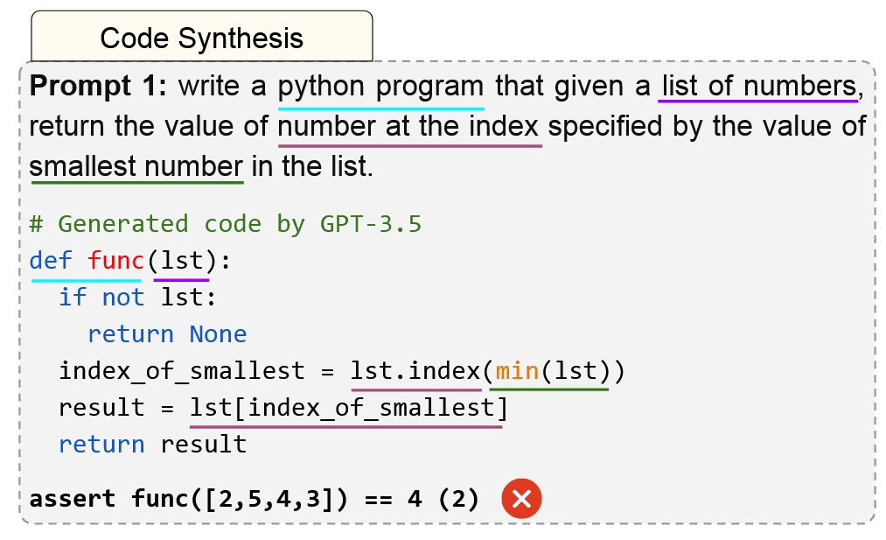
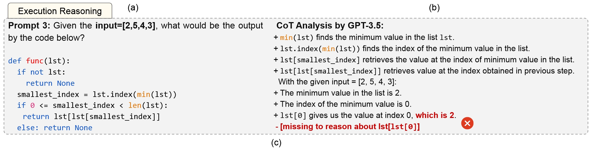
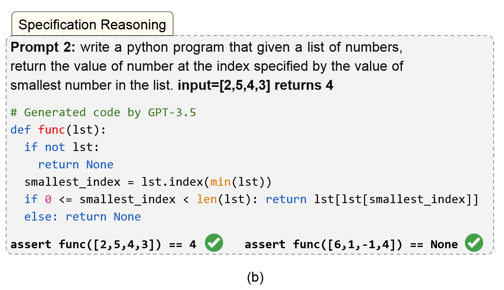
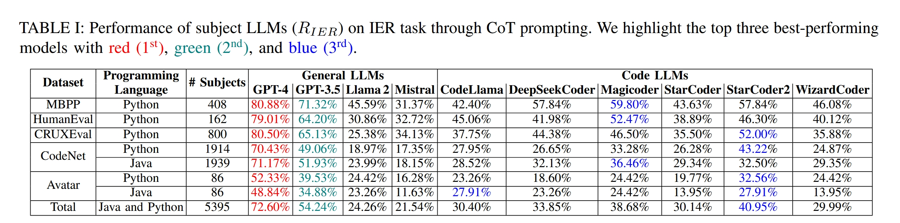
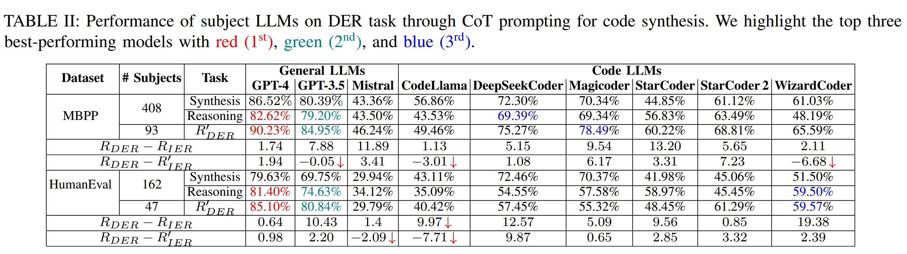
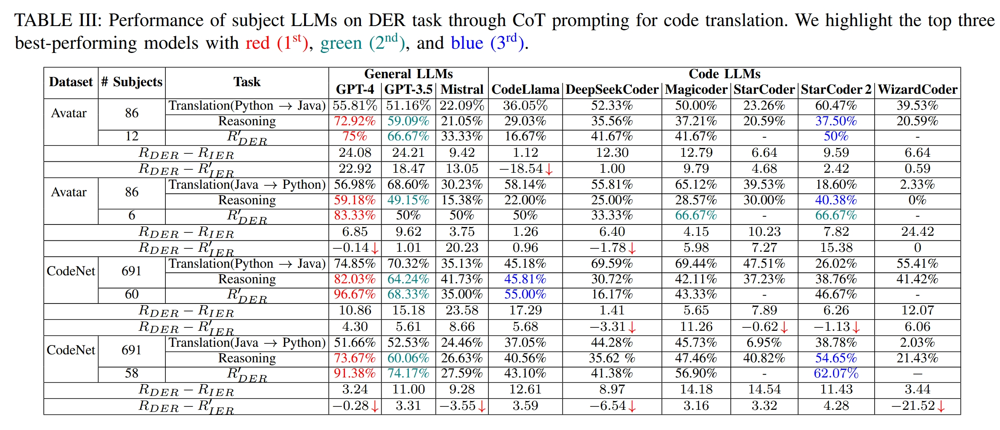
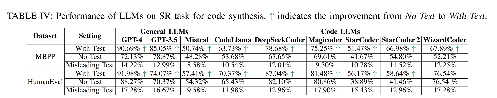
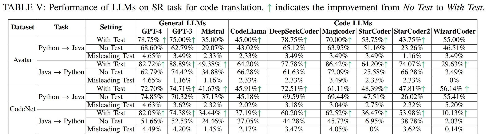
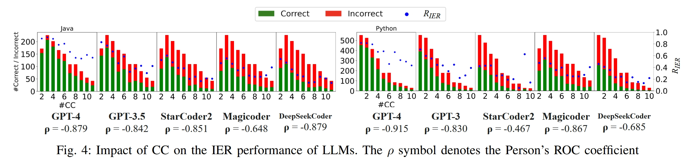
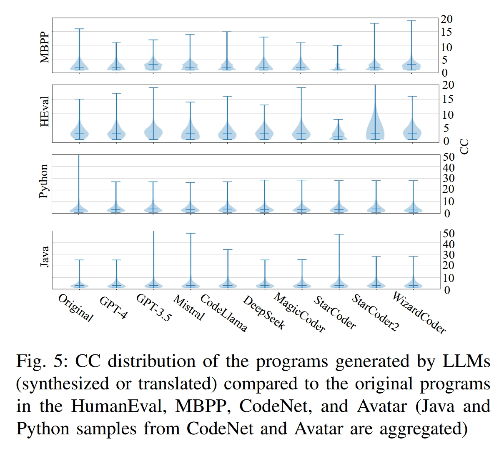

# CodeMind 总结 

[toc]

## 引入

“ CodeMind: A Framework to Challenge Large Language Models for Code Reasoning ”

> Univ. of Illinois at Urbana-Champaign[（UIUC：cs rank 2nd in the world during 10 years）](https://csrankings.org/#/index?all&world)
>
> [Changshu Liu](https://scholar.google.com/citations?user=cU2ynnIAAAAJ&hl=en)：电子科技大学（cd） - Columbia University - UIUC 
>
> 其有三篇工作，主要和LLM+代码分析相关的就是CodeMind
>
> **CodeMind: A Framework to Challenge Large Language Models for Code Reasoning（2024/2写完的还没发出来，但是被引已经30了）**
>
> 感觉和另一个UIUC的刘投的neurIps的工作[`EvalPlus`](https://arxiv.org/abs/2305.01210)相似度比较高
>
> 本质上就提出一个新的评估框架，之前评估LLMs的代码能力能力，只考虑了代码生成能力，这里考虑评估：独立执行推理（IER）、依赖执行推理（DER）和规范推理（SR），前两种任务评估模型预测任意代码或模型可以正确合成的代码的执行输出的能力。第三种任务评估LLMs实现指定预期行为的程度。然后做了一系列的实验与验证。
>
> 其实就是一个评估LLMs的代码推理能力工具和框架。
>
> 我感觉对我们研究有作用的点一个是可以用于参考之后论文中result的设计、评估方法的设计。

## 研究背景

大语言模型(LLMs)在代码生成领域展现出了显著的能力，特别是在使用指令调优或思维链式提示时。然而，代码合成能力并不等同于代码推理能力。如图1所示，LLMs可以生成看似正确但实际执行结果错误的代码，或者无法正确推理自己生成的代码的执行过程。这种现象突显了当前评估方法的局限性：主要关注代码生成质量，忽略了模型对代码执行逻辑的理解。

## 研究创新

本文提出了CodeMind框架，专门用于评估LLMs的代码推理能力。该框架定义了三种推理任务：

1. **独立执行推理(IER  Independent Execution Reasoning)**: 独立执行推理任务评估LLM对**任意代码**的执行推理能力。在这个任务中，我们给定一个程序C和一组输入I，要求LLM预测程序执行后的输出。如果LLM预测的输出与程序实际执行结果一致，则认为LLM能够正确推理该代码的执行过程。如图1(c)所示。IER评估一般代码理解能力，适用于代码阅读和分析场景。

   > **定义 1：独立执行推理（IER）**。给定一个程序 $C: C_I \rightarrow C_O$ 和输入集合 $\hat{I}=\left\{i \mid i \in C_I\right\}$，LLM 如果 $\hat{o}=C(\hat{I})$，其中 $\hat{o}=L(\hat{I})$ 是 $L$ 预测的输出，则 $L$ 可以正确地推理代码执行。注意，在此任务中，我们不处理规范，因此可以针对任何具有真实输入输出对 $\langle\hat{I}, \hat{o}\rangle$ 的任意代码评估 LLMs。

   

2. **依赖执行推理(DER Dependent Execution Reasoning)**: 评估模型能否预测**自己生成的正确代码**的执行结果，依赖于LLM自身的代码生成能力，评估模型的自洽性，适用于代码生成和维护场景。

   > **定义 2：依赖执行推理（DER）**。给定规范 $S: S_I \rightarrow S_O$，由 LLM $L$ 生成的程序 $C: C_I \rightarrow C_O$，以及输入集合 $\hat{I}=\left\{i \mid i \in C_I, C(i)= S(i)\right\}$，如果 $\hat{o}=C(\hat{I})$，其中 $\hat{o}=L(\hat{I})$ 是 $L$ 预测的输出，则 LLM $L$ 可以正确地推理代码执行。这里的假设是，当 LLM $L$ 生成通过测试 $\langle\hat{I}, \hat{o}\rangle$ 的代码 $C$ 时，它应该能够正确预测 $\hat{o}$。

3. **规范推理(SR)**: 评估模型能否理解并实现指定的行为要求，如图1(a、b)所示。

   > **定义 3：规范推理（SR）。** 给定一个规范 $S: S_I \rightarrow S_O$，以自然语言或编程语言表示，一个任意测试 $t=\langle i, o\rangle$，其中 $i \in S_I, o \in S_O, S(i)=o$，程序 $C_S: C_{S_I} \rightarrow C_{S_O}$（由 LLM $L$ 根据规范 $S$ 生成），以及程序 $C_{S+t}: C_{S+t_I} \rightarrow C_{S+t_O}$（由 LLM $L$ 根据规范 $S$ 和测试 $t$ 生成），如果 $C_{S+t}(i)=o \quad \& \quad C_S(i) \neq o$，则 LLM 可以正确地进行规范推理。换句话说，LLM $L$ 应该能够在提示中明确指定 $\langle i, o\rangle$ 时通过该测试，否则则不通过。这表明模型不仅仅是对规范进行了过拟合，而是能够对其进行推理。

   

这种多维度的评估方法使我们能够更全面地了解LLMs处理代码的能力。

## 实验设计与结果

研究团队选择了10个主流LLMs进行评估，包括通用模型(GPT-4、GPT-3.5、Llama 2等)和专门的代码模型(CodeLlama、StarCoder系列、Magicoder等)。

实验使用了5个基准数据集（HumanEval、MBPP、CodeNet、Avatar 和 CRUXEval ）的5395个Java和Python程序，涵盖代码生成和翻译两种任务。

> HumanEval 和 MBPP 是著名的代码生成基准
>
> CodeNet 和 Avatar 是代码翻译基准
>
> CRUXEval 是由 CodeLlama (34B) 生成的相对简单的 Python 程序基准，用于评估 LLMs 的输入预测和输出预测

实验采用了直接回答和思维链(CoT)两种提示方式，并通过标准化指标(R_IER、R_DER和R_SR)来量化模型表现。

### IER表现

表I展示了各模型在IER任务上通过CoT（思维链）提示方式的表现。GPT-4在几乎所有数据集上表现最佳，总体准确率达到72.60%，领先第二名GPT-3.5(54.24%)近20个百分点。在专门的代码模型中，StarCoder2表现最好，总体准确率为40.95%。

数据还显示，模型在不同数据集上的表现存在显著差异：

- MBPP和HumanEval数据集上表现普遍较好
- Avatar数据集上表现普遍较差，即使是顶级模型GPT-4也仅达到约50%的准确率
- Python代码的推理通常比Java代码更准确

### 代码生成DER表现

表II呈现了模型在自己生成的代码上进行推理的能力。几乎所有模型在DER任务上都比IER表现更好，表明模型对自己生成的代码有更好的理解。

> Synthesis（合成）：模型生成正确代码的成功率
>
> Reasoning（推理）：模型对其生成的所有代码(无论正确与否)进行执行推理的准确率
>
> R'_DER：模型对其成功生成的代码进行执行推理的准确率（这是真正的DER指标）
>
> R_DER - R_IER：DER与普通IER的原始差值
>
> R'\_DER - R'\_IER：考虑到任务难度后的标准化差值

MBPP数据集上，GPT-4的DER准确率高达90.23%，比同样数据集上的IER准确率(80.88%)高出约10个百分点。特别值得注意的是，专门的代码模型在DER任务上的提升更为明显，如DeepSeekCoder和Magicoder在MBPP上的DER准确率比IER高出约20个百分点。

表格底部的R_DER - R_IER指标显示了模型在DER和IER之间的性能差异，正值表示模型在理解自己生成的代码方面更为出色。

### 代码翻译DER表现

表III展示了模型在代码翻译任务下的DER表现。在Python到Java的翻译中，GPT-4表现突出，在Avatar数据集上达到75%的准确率，比IER提升了约24个百分点；在CodeNet数据集上达到96.67%的准确率，提升了近11个百分点。

同时，许多模型在代码翻译任务上的DER-IER差异更为显著，表明翻译任务可能比合成任务需要更深入的推理能力。例如，GPT-3.5在Avatar数据集的Python到Java翻译上，DER比IER高出24.21个百分点。

### 代码生成SR表现

各模型在代码合成任务上的SR能力。提供测试用例("With Test")显著提高了所有模型的性能。但是应对误导性测试不行，作者话术好牛，说通过误导性测试更能证明模型能够推理规范中的测试数据并将其融入代码生成。

### 代码翻译SR表现

测试用例在代码翻译任务中同样有效。在Avatar数据集的Java到Python翻译中，GPT-3.5的准确率从74.42%提升到88.89%，增长了14.47个百分点。

## 主要发现

### 1. 模型表现差异

- GPT模型在代码推理方面显著优于开源模型，差距比代码生成任务更大

- 图3直观展示了CoT提示方式相比直接回答对IER性能的提升，GPT模型在所有基准上都表现最佳

  

### 2. 代码复杂性导致的推理能力限制

- 所有模型在复杂代码结构面前表现下降

- 图4显示代码复杂度与推理性能呈显著负相关，相关系数在-0.467到-0.915之间

  

- 图5表明模型生成的代码复杂度与原始代码相当，甚至更高，但如之前提到的表II和表III所示，模型在对自己生成的代码进行推理时表现更好(DER高于IER)

  

### 3. 影响因素分析与改进

- **循环相关因素**: 循环长度与推理性能负相关
- **代码结构影响**: 不同代码结构对推理性能的影响
- **输出类型影响**: 模型在预测基本类型(如Int、Binary)时准确率高，但在复杂类型(如List、Tuple)上准确率低

