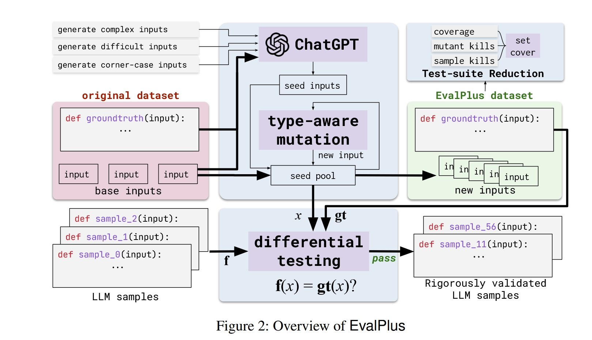
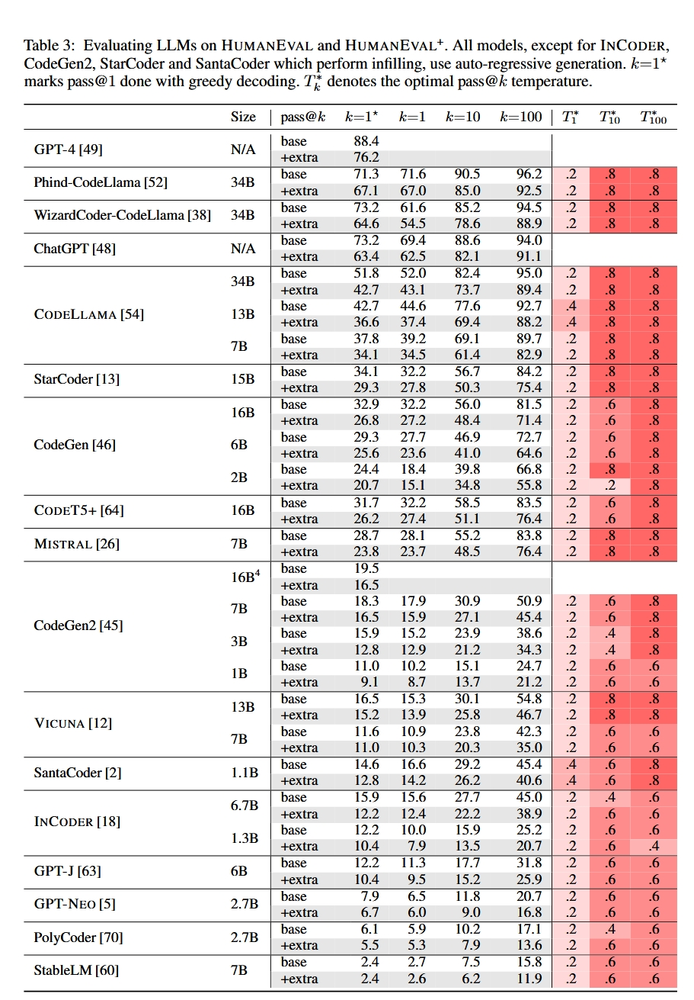
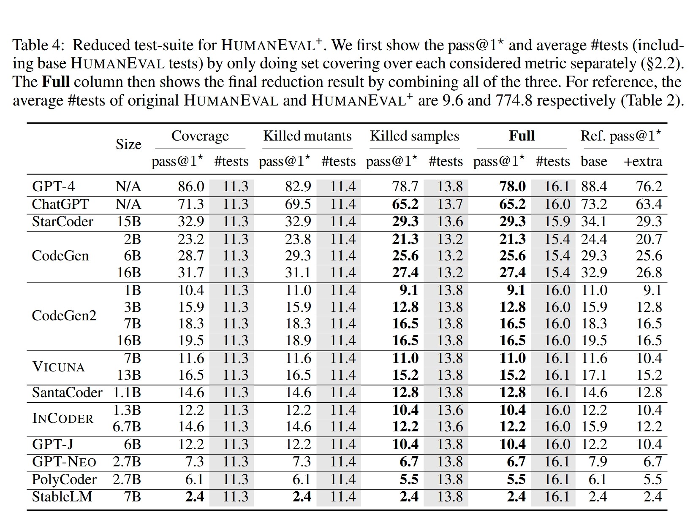
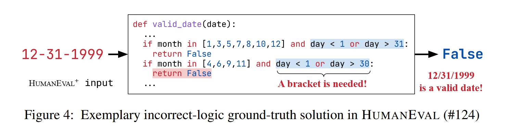
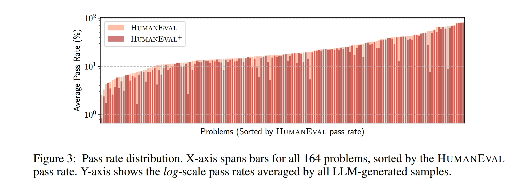

# EvalPlus总结

> EvalPlus通过结合LLM和变异测试技术，创建了更严格、更全面的代码评估框架。研究表明，现有的评估方法高估了LLM生成代码的正确性，而EvalPlus能够暴露先前未被检测的错误。这项工作不仅提供了更可靠的评估工具，还为未来LLM代码生成的研究和应用指明了方向。
>
> 和上一篇一样，也是UIUC的博士写的，甚至都是刘，但不是一个人。发在了NeurIps上，被引量900+。
>
> 体验是这篇文章阅读体验真的真的真的远高于上一篇，问题讲的很清楚，思路明确。上一篇有点在评估最后有点偏离重心，整个的行文逻辑也有点乱。这一篇就很优美简洁。不愧是900+

[toc]

## 1. 背景

论文"ChatGPT生成的代码真的正确吗？大型语言模型代码生成的严格评估"针对AI驱动的代码生成领域中一个关键问题：当前评估LLM生成代码的测试框架不足。

**现有评估方法的主要问题：**

- **测试不足**：当前的编程基准测试如HumanEval每个编码问题平均包含不到10个测试用例，这些测试通常过于简单，无法全面探索边界情况和功能正确性。
- **问题描述不精确**：现有基准测试中的任务描述往往过于模糊，未能明确指定输入域或异常处理要求。
- **不正确的标准解答**：发现HumanEval中约11%的"标准答案"存在缺陷，包括未处理的边界情况和逻辑错误。

## 2. 研究贡献与创新

**主要贡献：**

1. **首次深入研究**了当前编程基准测试中测试不足问题，这可能导致功能正确性被大幅高估。

   

2. **提出了EvalPlus**：一个评估框架，通过自动化测试生成来严格评估LLM合成代码的功能正确性。

3. **创建了HumanEval+**：将HumanEval基准测试的测试用例扩展了80倍，并修复了其中的错误解答。

4. **开发了测试套件缩减技术**：创建了HumanEval+-Mini，在保持相似测试效果的同时将测试规模缩小了47倍。

## 3. 研究方法与技术框架

EvalPlus工作流：

1. 从原始数据集（original dataset）获取标准答案和基础测试输入

2. 使用ChatGPT生成高质量的种子测试输入

3. 对种子输入进行类型感知变异，扩展生成大量测试用例

4. 使用差分测试评估LLM生成代码的正确性

5. 应用测试套件缩减技术，生成规模更小但效果相当的测试集

6. 最终得到EvalPlus数据集，用于更严格地评估LLM代码生成能力

EvalPlus的核心工作流程包括三个主要组件：

### a. 自动化测试输入生成

- **种子初始化**：利用ChatGPT生成高质量的种子输入，为后续变异提供基础

  > 图中左侧显示了三种生成指令："generate complex inputs"、"generate difficult inputs"和"generate corner-case inputs"
  >
  > 这些指令被发送给ChatGPT，引导其生成高质量的种子测试输入
  >
  > ChatGPT可以理解原始问题和现有测试用例的模式，从而生成有意义的新测试用例
  >
  > 这一步骤解决了手动创建复杂测试用例耗时且困难的问题

- **类型感知输入变异**：基于种子输入执行类型感知变异，快速生成大量有效的测试输入

  > 从ChatGPT获得种子输入后，这些输入被存入"seed pool"（种子池）
  >
  > 种子池中的输入随后经过"type-aware mutation"（类型感知变异）模块处理
  >
  > 该模块会根据输入的数据类型执行相应的变异操作（如图中未显示但在论文表1中详述）
  >
  > 例如，对整数进行加减变异，对列表进行元素添加/删除/替换，对字符串进行子串操作等
  >
  > 生成的新输入会被添加回种子池，形成一个迭代过程
  >
  > 这种方法可以快速大量地生成有效测试输入，比纯使用ChatGPT更高效

- **差分测试评估**

  评估阶段采用了差分测试方法，确保了评估的可靠性：

  > 系统将生成的测试输入同时提供给标准解答函数和LLM生成的代码样本
  >
  > 通过比较两者的输出（f(x) = gt(x)?），严格评估LLM代码的功能正确性
  >
  > 这种方法避免了传统评估方法的主观性，提供了客观的正确性度量

### b. 测试套件缩减

为解决测试执行成本问题，EvalPlus设计了智能的测试套件缩减机制：

- 系统实现了三种互补的缩减策略：
  - **代码覆盖率**：保留能维持相同代码分支覆盖的最小测试子集
  - **变异体杀死**：确保能检测相同变异错误的最小测试集合
  - **LLM样本杀死**：保证能检测错误LLM样本的最小测试集合
- 通过集合覆盖算法，系统可以将大规模测试集（如HumanEval+平均每任务764.1个测试）缩减至更小规模（如HumanEval+-Mini平均每任务16.1个测试），同时保持相当的测试效果

### c. 程序输入契约

为增强评估的精确性，EvalPlus引入了程序契约机制：

- 采用契约式编程理念，通过代码断言形式明确标注函数前置条件
- 这些契约既过滤掉无效输入，又提供了更为明确的函数行为描述
- 确保了评估过程中使用的测试用例都是合理且有意义的

这种多层次、多组件的设计使EvalPlus能够提供比现有评估方法更为严格、全面且高效的代码评估能力，为LLM代码生成领域建立了新的评估标准。

## 4. 实验评估与关键发现

实验设置

- 对26个流行的LLM模型进行全面测试

- 使用多种温度设置(0.2, 0.4, 0.6, 0.8)和贪婪解码

- 评估pass@k指标(k∈{1, 10, 100})的变化

  > pass@k是评估代码生成模型性能的关键指标，它度量的是：**模型从k个生成样本中至少有一个通过所有测试用例的概率**。
  >
  > pass@1*：使用贪婪解码（温度为0）生成的确定性样本通过测试的概率

关键发现

### a. HumanEval+暴露了大量之前未被检测的错误代码

> 表 3：在 HumanEval 和 HumanEval ${ }^{+}$上评估 LLMs。除 InCoder、CodeGen2、StarCoder 和 SantaCoder（它们执行填充）外，所有模型均使用自回归生成。$k=1^{\star}$表示使用贪婪解码完成的 pass@1。$T_k^*$表示最优的 pass@ $k$温度。

- 所有模型在HumanEval+上的pass@k指标显著下降
- 最高下降幅度：pass@1*下降23.1%，pass@1下降19.3%，pass@10下降24.9%，pass@100下降28.9%
- 即使是最先进的模型如GPT-4和ChatGPT也分别下降了13.1%和12.6%

### b. 更严格的评估改变了模型排名

- WizardCoder-CodeLlama和Phind-CodeLlama在原始HumanEval上不如ChatGPT
- 在HumanEval+上，这两个开源模型实际上超过了ChatGPT

### c. 测试套件缩减仍然保持有效性

> 表 4：HumanEvaL ${ }^{+}$ 的简化测试套件。我们首先展示仅针对每个考虑的指标分别进行集合覆盖时的 pass@ $1^{\star}$ 和平均测试数量（包括基础 HumanEval 测试）（§2.2）。Full 列则显示通过结合所有三个指标得到的最终简化结果。作为参考，原始 HUMANEvAL 和 HUMANEvAL+ 的平均测试数量分别为 9.6 和 774.8（表 2）。 

- HumanEval+-Mini使用47倍更少的测试用例，仍能达到与HumanEval+相似的评估效果
- LLM样本杀死策略最为有效，但也消耗更多测试用例

### d.发现HumanEval中的标准答案错误

 

- 检测到18处缺陷(11%的问题)：5个未处理边界情况，10个逻辑错误，3个性能问题
- 图4展示了一个日期验证函数中由于运算符优先级导致的逻辑错误

### e.模型在不同难度问题上的表现差异化很大

图 3：通过率分布。X 轴表示所有 164 个问题的条形图，按 HumanEval 通过率排序。Y 轴显示所有 LLM 生成样本的通过率的对数尺度平均值。

- 简单问题(如"加两个数字")容易被解决
- 涉及多条件、完整性、推理能力和效率要求的问题对LLM最具挑战性

## 5. 研究意义与未来方向

研究意义：

- 表明先前流行的代码合成评估结果未能准确反映LLM在代码合成中的真实表现
- 开辟了通过自动化测试改进编程基准测试的新方向
- EvalPlus已被广泛采用，5个月内PyPI包安装超过6000次

未来方向：

- 将EvalPlus应用于更多代码基准测试(如MBPP)
- 集成更正式的验证方法(如Dafny)或验证技术
- 将核心测试生成技术用于AI配对编程(如Copilot)，提醒开发者潜在代码缺陷