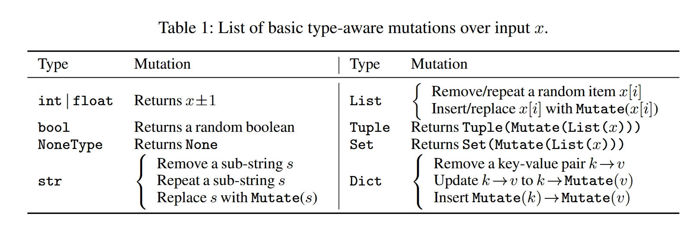
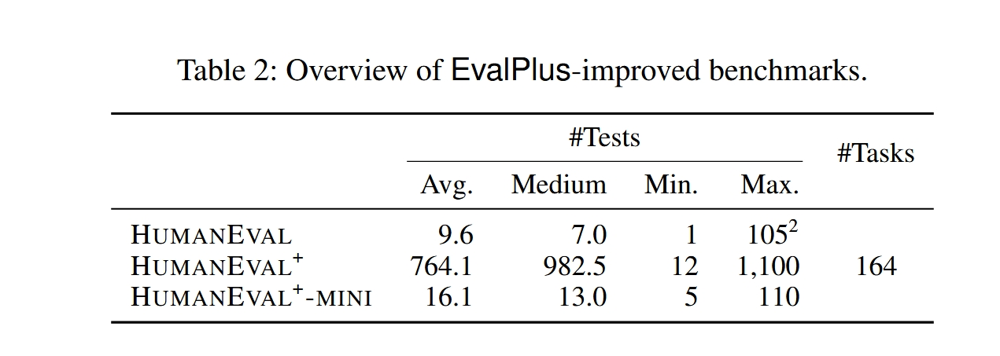
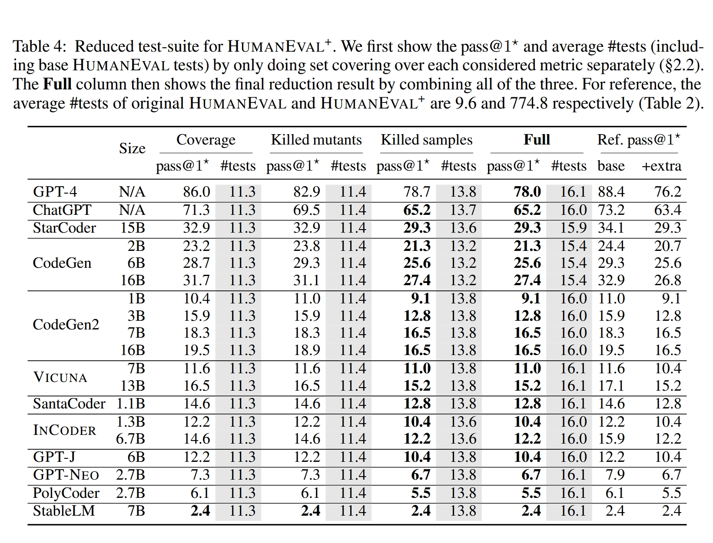

# Is Your Code Generated by ChatGPT Really Correct? Rigorous Evaluation of Large Language Models for Code Generation

> **Is your code generated by chatgpt really correct? rigorous evaluation of large language models for code generation**
>
> 发在了NeurIps上，被引量900+
>
> 主要成就：
>
> 1. 比较早提出了更严格的代码合成评估框架；
> 2. 开创了通过自动化测试改进编程基准的新方向——通过自动化方法大幅扩展测试用例（将HumanEval基准测试的测试用例扩展了80倍，创建了HumanEval+）
> 3. 表明现有的代码合成评估结果不能准确反映LLMs的真实性能；
> 4. 开源了工具、增强数据集和LLM生成的代码 [github](https://github.com/evalplus/evalplus)

[toc]

## Abstract

Program synthesis has been long studied with recent approaches focused on directly using the power of Large Language Models (LLMs) to generate code. Programming benchmarks, with curated synthesis problems and test-cases, are used to measure the performance of various LLMs on code synthesis. However, these test-cases can be limited in both quantity and quality for fully assessing the functional correctness of the generated code. Such limitation in the existing benchmarks begs the following question: In the era of LLMs, is the code generated really correct? To answer this, we propose EvalPlus – a code synthesis evaluation framework to rigorously benchmark the functional correctness of LLM-synthesized code. EvalPlus augments a given evaluation dataset with large amounts of test-cases newly produced by an automatic test input generator, powered by both LLM- and mutation-based strategies. While EvalPlus is general, we extend the test-cases of the popular HUMANEVAL benchmark by 80× to build HUMANEVAL+. Our extensive evaluation across 26 popular LLMs (e.g., GPT-4 and ChatGPT) demonstrates that HUMANEVAL+ is able to catch significant amounts of previously undetected wrong code synthesized by LLMs, reducing the pass@k by up-to 19.3-28.9%. We also surprisingly found that test insufficiency can lead to mis-ranking. For example, both WizardCoder-CodeLlama and Phind-CodeLlama now outperform ChatGPT on HUMANEVAL+, while none of them could on HUMANEVAL. Our work not only indicates that prior popular code synthesis evaluation results do not accurately reflect the true performance of LLMs for code synthesis, but also opens up a new direction to improve such programming benchmarks through automated testing. We have open-sourced our tools, enhanced datasets as well as all LLM-generated code at https://github.com/evalplus/evalplus to facilitate and accelerate future LLM-for-code research.

> 程序生成一直是研究的重点，最近的方法集中于直接利用大型语言模型（LLMs）的强大能力来生成代码。编程基准测试通过精心设计的合成问题和测试用例，用于衡量各种 LLMs 在代码合成上的表现。然而，这些测试用例在数量和质量上都可能有限，难以全面评估生成代码的功能正确性。现有基准测试的这种局限性引出了以下问题：在 LLMs 时代，生成的代码真的正确吗？
>
> 为了解答这个问题，我们提出了 EvalPlus——一个代码合成评估框架，用于严格基准测试 LLM 合成代码的功能正确性。EvalPlus 通过自动测试输入生成器，结合 LLM 和变异策略，向给定的评估数据集新增大量测试用例。
>
> 虽然 EvalPlus 具有通用性，我们将流行的 HUMANEVAL 基准测试的测试用例扩展了 80 倍，构建了 HUMANEVAL+。 我们对 26 个流行的 LLMs（例如 GPT-4 和 ChatGPT）进行了广泛评估，结果表明 HUMANEVAL+能够发现大量之前未被检测出的 LLMs 合成的错误代码，使 pass@k 降低了 19.3%至 28.9%。我们还惊讶地发现测试不足可能导致错误排序。例如，WizardCoder-CodeLlama 和 Phind-CodeLlama 现在在 HUMANEVAL+上的表现超过了 ChatGPT，而在 HUMANEVAL 上则没有。
>
> 我们的工作不仅表明以往流行的代码合成评估结果未能准确反映 LLMs 在代码合成中的真实表现，还开辟了通过自动化测试改进此类编程基准的新方向。我们已开源了我们的工具、增强的数据集以及所有 LLM 生成的代码，地址为 https://github.com/evalplus/evalplus，以促进和加速未来 LLM-for-code 的研究。

## Introduction

Automatically generating programs that accurately correspond to user intents is a long-standing challenge in computer science known as program synthesis . In the past few decades, classical program synthesis techniques have been developed, including deductive synthesis , inductive synthesis and neural-guided synthesis . More recently, with the advent of Large Language Models (LLMs) and the abundance of open codebase, researchers have been focusing on applying LLMs for direct code generation. LLMs like CoDEX and CodeGen perform code generation by autoregressively predicting the next token given previous context, in the form of function signature and docstring that denote the desired program functionality. The generated code snippet is then combined with the context to form a complete function that aligns with the user intent. Leveraging both natural language understanding and generative power, LLMs have demonstrated impressive performance in code synthesis .

> 自动生成与用户意图准确对应的程序是计算机科学中一个长期存在的挑战，称为程序合成。在过去几十年中，已经开发了经典的程序合成技术，包括演绎合成、归纳合成和神经引导合成。最近，随着 LLMs 的出现和大量开源代码库的丰富，研究人员开始专注于应用 LLMs 进行直接代码生成。像 CoDEX 和 CodeGen 这样的 LLMs 通过自回归地预测下一个标记来执行代码生成，给定之前的上下文，以函数签名和文档字符串的形式表示所需的程序功能。生成的代码片段随后与上下文结合，形成与用户意图一致的完整函数。利用自然语言理解和生成能力，LLMs 在代码合成方面展示了令人印象深刻的性能。

The primary concern when it comes to LLM-generated code is correctness. Because two dramatically different code snippets can be semantically equivalent, classic NLP metrics like BLEU score are no longer reliable in the context of program synthesis. Ideally, we would like to formally verify the correctness of LLM-provided solutions for any input, but verifying domain-specific problems through methods such as translation validation is already challenging enough, let alone building a general verifier with absolute certainty to prove arbitrary problems, including those in code benchmarks. As such, existing code benchmarks (e.g., HumanEval ) heavily rely on manually constructed test-cases to evaluate LLM solutions. However, these tests often fall short in capturing all possible scenarios, as crafting high-quality tests is laborious. Consequently, we argue that current programming benchmarks are inadequate for assessing the actual correctness of LLM-generated code, leading to false confidence in the results. Specifically, we have identified the following common limitations in existing LLM-for-code benchmarks:

> 当涉及到 LLM 生成的代码时，主要关注点是正确性。因为两个截然不同的代码片段可能在语义上是等价的，传统的 NLP 指标如 BLEU 分数在程序合成的背景下已不再可靠。理想情况下，我们希望能够形式化地验证 LLM 提供的解决方案在任何输入下的正确性，但通过诸如翻译验证等方法验证特定领域的问题已经相当具有挑战性，更不用说构建一个能够绝对确定地证明任意问题（包括代码基准测试中的问题）的一般验证器了。因此，现有的代码基准测试（例如 HumanEval）在很大程度上依赖手工构建的测试用例来评估 LLM 的解决方案。然而，这些测试往往难以涵盖所有可能的场景，因为编写高质量的测试非常费力。因此，我们认为当前的编程基准测试不足以评估 LLM 生成代码的实际正确性，导致对结果产生错误的信心。具体来说，我们发现现有的 LLM-for-code 基准测试存在以下常见局限性：

- **Insufficient testing.** Current programming benchmarks often only include on average less than 10 tests for each coding problem. Furthermore, these tests are relatively too simple to fully explore the functionality of the code or corner cases. Figure 1 shows an incorrect code sample synthesized by ChatGPT to return the sorted unique common elements from two lists. At first glance, the function looks correct and computes the desired output when using the base test inputs from HumanEval. However, in the return statement, it incorrectly converts the intermediate list to a set which no longer preserves the order of the sorted list. This example shows that a logically flawed solution can still pass all simple tests and be misconsidered as correct due to testing inadequacy.

  > **测试不足。** 当前的编程基准测试通常每个编码问题平均只包含不到 10 个测试用例。此外，这些测试相对过于简单，无法充分探索代码的功能或边界情况。图 1 展示了 ChatGPT 合成的一个错误代码示例，该代码旨在返回两个列表中排序后的唯一公共元素。乍一看，该函数看起来正确，并且在使用 HumanEval 的基础测试输入时计算出期望的输出。然而，在返回语句中，它错误地将中间列表转换为集合，导致不再保留排序列表的顺序。这个例子表明，逻辑上有缺陷的解决方案仍然可以通过所有简单测试，并因测试不足而被误认为是正确的。

  

- **Imprecise problem description**. The input for code generation includes natural language descriptions in addition to the function signature. These task descriptions in existing benchmarks are oftentimes too vague to fully clarify the expected program behaviors. For example, the input docstring may not specify the expected input domain (e.g., only positive integers) or how the function should handle exceptions. As a result, such programming problems can be interpreted differently by LLMs against the actual tests, leading to capable LLMs misjudged as incapable.

  > **不精确的问题描述**。代码生成的输入除了函数签名外，还包括自然语言描述。现有基准测试中的这些任务描述往往过于模糊，无法完全明确预期的程序行为。例如，输入的文档字符串可能未指定预期的输入域（例如，仅正整数）或函数应如何处理异常。因此，这类编程问题可能被 LLMs 与实际测试的理解不同，导致有能力的 LLMs 被误判为无能。

These limitations are common across many popular code generation benchmarks . This not only questions the validity of the impressive performance claimed by prior work but also sets a challenge on how to properly evaluate the LLM coders. In this paper, we aim to address this fundamental evaluation challenge and ask the introspective question: Is the code generated by LLMs really correct?

> 这些限制在许多流行的代码生成基准测试中普遍存在。这不仅质疑了先前工作所声称的令人印象深刻的性能的有效性，也对如何正确评估 LLM 编码器提出了挑战。在本文中，我们旨在解决这一根本的评估挑战，并提出一个反思性的问题：LLMs 生成的代码真的正确吗？

**Our proposal**. In this work, we set out to answer the important question and evaluate the evaluation dataset. Consequently, we build EvalPlus - an evaluation framework to improve existing code benchmarks in order to precisely evaluate the functional correctness of LLM-generated code. At the heart of EvalPlus is an automatic test input generation engine which augments existing code benchmarks by generating interesting test inputs to fully exercise the code solution and check its functional correctness by cross-checking the ground-truth implementation. Specifically, EvalPlus adopts both LLM- and mutation-based methods to automatically generate and diversify additional test inputs. EvalPlus first uses ChatGPT to generate a set of high-quality seed inputs that aim to test difficult corner cases and functionalities of the program within the valid input structure. Using these high-quality seed inputs, EvalPlus then performs type-aware mutation to efficiently generate a large number of additional test inputs. These newly generated test inputs are then used to evaluate the LLM-generated code through differential testing against the ground-truth implementation. Furthermore, as an option to speed up evaluation, EvalPlus also builds minimal test-suites by only including the most valuable test-cases, which are selected by running a greedy set cover algorithm to preserve the same code coverage , mutation analysis as well as empirical LLM sample killings.

> **我们的提案**。在本工作中，我们着手回答一个重要问题并评估评测数据集。因此，我们构建了 EvalPlus——一个评测框架，用于改进现有代码基准，以精确评估 LLM 生成代码的功能正确性。EvalPlus 的核心是一个自动测试输入生成引擎，通过生成有趣的测试输入来增强现有代码基准，充分测试代码解决方案并通过交叉验证真实实现来检查其功能正确性。具体来说，EvalPlus 采用基于 LLM 和变异的方法自动生成和多样化额外的测试输入。EvalPlus 首先使用 ChatGPT 生成一组高质量的种子输入，旨在测试程序内有效输入结构中的困难边界情况和功能。利用这些高质量的种子输入，EvalPlus 随后执行类型感知变异，以高效生成大量额外的测试输入。然后，这些新生成的测试输入被用来通过与真实实现的差分测试评估 LLM 生成的代码。 此外，作为加快评估的一个选项，EvalPlus 还通过仅包含最有价值的测试用例来构建最小测试套件，这些测试用例是通过运行贪婪集合覆盖算法选择的，以保持相同的代码覆盖率、变异分析以及经验性的 LLM 样本杀伤。

**Contribution**. Our work revisited and proposed to automatically improve code benchmarks for LLMs:

> 贡献。我们的工作重新审视并提出了自动改进 LLMs 代码基准的方法：

- **Study**: We are the first to study the test inadequacy problem in current programming benchmarks which can lead to largely over-approximated functional correctness. Our study also opens up a new research direction for precisely and rigorously evaluating LLM-synthesized code.

  > 研究：我们是首个研究当前编程基准测试不足问题的团队，该问题可能导致功能正确性的极大过度估计。我们的研究还为精确且严格地评估 LLM 合成代码开辟了新的研究方向。

- **Approach**: We propose EvalPlus - an evaluation framework to reveal the real correctness of LLM-synthesized code. The test-case generation approach of EvalPlus combines the emerging LLM-based and traditional mutation-based test input generation. It first uses LLM-based strategy to bootstrap the test generator with high-quality seed inputs and then further extends large amounts of inputs via type-aware mutation. We then optionally "distill" the generated tests to a much smaller yet almost equivalently effective test-suite via greedy set covering. We also propose to annotate each programming tasks using program contracts to filter out invalid inputs.

  > 方法：我们提出了 EvalPlus——一个评估框架，用于揭示 LLM 合成代码的真实正确性。EvalPlus 的测试用例生成方法结合了新兴的基于 LLM 和传统的基于变异的测试输入生成。它首先使用基于 LLM 的策略，以高质量的种子输入引导测试生成器，然后通过类型感知变异进一步扩展大量输入。随后，我们可选择通过贪婪集合覆盖将生成的测试“蒸馏”成一个更小但几乎同样有效的测试套件。我们还建议使用程序契约对每个编程任务进行注释，以过滤无效输入。

- **Results**: EvalPlus extends the popular HumanEval benchmark to create HumanEval ${ }^{+}$, improving the test-case scale by $80 \times$. Through test-suite reduction, we also produce HU MANEVAL ${ }^{+}$-MINI which distills HUMANEVAL ${ }^{+}$tests by $47 \times$ while still achieving a similar level of testing effectiveness. Our extensive evaluation over 26 popular LLMs surprisingly finds that the pass@ $k$ on the new dataset is up-to 19.3-28.9% (for different $k \mathrm{~s}$ ) lower than the base HumANEVAL, showing that testing insufficiency can largely affect the result analysis for almost all recent work on LLM-based code generation. Meanwhile, on the original HumanEval both of the 34B WizardCoder-CodeLlama and Phind-CodeLlama models are deemed to be no better than ChatGPT, while HumanEval ${ }^{+}$corrected the ranking and shows that the two open-source models are actually better. Additionally, we even found that the ground-truth solutions of HumanEval can be erroneous, further calling into question the quality of code synthesis benchmarks.

  > 结果：EvalPlus 扩展了流行的 HumanEval 基准，创建了 HumanEval ${ }^{+}$，将测试用例规模提升了 $80 \times$。通过测试套件缩减，我们还生成了 HUMANEVAL ${ }^{+}$-MINI，将 HUMANEVAL ${ }^{+}$ 测试用例精简了 $47 \times$，同时仍保持类似的测试效果。我们对 26 个流行的 LLMs 进行了广泛评估，惊人地发现新数据集上的 pass@ $k$ 比基础 HumanEval 低了 19.3-28.9%（针对不同的 $k$ 值），表明测试不足在很大程度上影响了几乎所有基于 LLM 的代码生成最新工作的结果分析。与此同时，在原始 HumanEval 上，34B WizardCoder-CodeLlama 和 Phind-CodeLlama 两个模型都被认为不如 ChatGPT，而 HumanEval ${ }^{+}$ 修正了排名，显示这两个开源模型实际上更优。此外，我们甚至发现 HumanEval 的真实解答可能存在错误，进一步质疑了代码合成基准的质量。

## Approach

Figure 2 shows the overview of EvalPlus. We first take in as input the original dataset containing the ground-truth implementation as well as the base test inputs. EvalPlus starts with constructing a prompt using the original ground-truth, exemplary test inputs as demonstration, and a specialized instruction to query ChatGPT and generate a set of high-quality seed inputs. ChatGPT, by following base input formats and inspecting the ground-truth solution, can serve as a vehicle to generate valid yet rigorous test inputs. Starting from these seed inputs, we then perform type-aware mutation to quickly generate numerous new inputs together with seed inputs to extensively evaluate the functional correctness of LLM-generated code. We use differential testing as the oracle to cross-check the output of the ground-truth and LLM-generated solution. As an option to speed up evaluation, EvalPlus runs set covering to minimize the generated test-suite while preserving the same level of testing effectiveness. As the final output, EvalPlus obtains a augmented benchmark using the generated high-quality test inputs to fully evaluate the functional correctness of LLM-synthesized code.

> 图 2 展示了 EvalPlus 的概述。我们首先输入包含真实实现和基础测试输入的原始数据集。EvalPlus 从构建一个提示开始，该提示使用原始真实实现、示范性的测试输入作为示例，以及专门的指令来查询 ChatGPT 并生成一组高质量的种子输入。ChatGPT 通过遵循基础输入格式并检查真实解决方案，可以作为生成有效且严格测试输入的工具。从这些种子输入开始，我们随后执行类型感知变异，快速生成大量新输入以及种子输入，以广泛评估 LLM 生成代码的功能正确性。我们使用差分测试作为判定标准，交叉检查真实实现和 LLM 生成解决方案的输出。为了加快评估，EvalPlus 还可选择运行集合覆盖，最小化生成的测试套件，同时保持相同的测试效果。作为最终输出，EvalPlus 利用生成的高质量测试输入获得增强的基准，用以全面评估 LLM 合成代码的功能正确性。

### 1. Automated Test Input Generation 自动化测试输入生成

**Seed initialization via ChatGPT**. EvalPlus first uses ChatGPT to generate a set of high-quality seed inputs for later mutation. Following Figure 2, we construct a prompt using $(i)$ the ground-truth solution of the problem for ChatGPT to inspect; (ii) a set of test inputs as demonstration; and (iii) an instruction to encourage ChatGPT to come up with interesting inputs. Specifically, each prompt starts with the ground-truth implementation and then randomly sampled test inputs from the existing dataset. We then finalize the prompt with a selected instruction in Figure 2 and query ChatGPT to produce new inputs. EvalPlus aims to leverage the powerful understanding ability of ChatGPT to learn both the valid input formats (e.g., variable types) as well as the desired functionality of the ground-truth solution in order to produce meaningful test inputs to reveal bugs in incorrectly synthesized code. Programs can have their own expected input formats, where invalid inputs should not be passed into the function as they can incur undefined behaviors to create false-positives in differential testing. As such, we filter out any invalid inputs which violate the input precondition required by the ground-truth implementation.

> **通过 ChatGPT 进行种子初始化**。EvalPlus 首先使用 ChatGPT 生成一组高质量的种子输入以供后续变异。根据图 2，我们构建了一个提示，包含 $(i)$ 供 ChatGPT 检查的问题的真实解；$(ii)$ 一组作为示范的测试输入；以及 $(iii)$ 一条鼓励 ChatGPT 生成有趣输入的指令。具体来说，每个提示以真实实现开始，然后从现有数据集中随机抽取测试输入。接着，我们用图 2 中选定的指令完成提示，并查询 ChatGPT 生成新的输入。EvalPlus 旨在利用 ChatGPT 强大的理解能力，学习有效的输入格式（例如变量类型）以及真实解的期望功能，从而生成有意义的测试输入，以揭示错误合成代码中的漏洞。程序可能有其自身的预期输入格式，非法输入不应传入函数，因为它们可能导致未定义行为，从而在差分测试中产生误报。 因此，我们过滤掉任何违反真实实现所需输入前提条件的无效输入。

By using ChatGPT as an automated generation engine, we can generate inputs that are valid even under semantic constraints. For example, a programming problem may require the input to conform to a specific structure (e.g., a palindrome). Such semantic constraints can be extremely difficult for traditional input generators to satisfy. However, ChatGPT is unsuitable for large amounts of automated test generation due to undesired speed and cost of querying such a large model. To address this, we perform type-aware input mutation starting from high-quality seed inputs generated by ChatGPT.

> 通过使用 ChatGPT 作为自动生成引擎，我们可以生成即使在语义约束下也有效的输入。例如，一个编程问题可能要求输入符合特定结构（例如回文）。传统的输入生成器很难满足这种语义约束。然而，由于查询如此大型模型的速度和成本不理想，ChatGPT 不适合大量自动测试生成。为了解决这个问题，我们从 ChatGPT 生成的高质量种子输入开始，执行类型感知的输入变异。

**Type-aware input mutation.** We follow a typical mutation-based fuzzing workflow to continuously create inputs: (i) a corpus of seed inputs from ChatGPT are used to initialize the seed pool and bootstrap the generation pipeline; (ii) each time an input (i.e., seed) from the seed pool is randomly selected to be mutated to a new input (i.e., mutant); and (iii) new inputs that comply with the program contract (§2.3) are added to the seed pool and we start over from (ii) to continue the generation process.

> **类型感知的输入变异。** 我们遵循典型的基于变异的模糊测试工作流程来持续创建输入：(i) 使用来自 ChatGPT 的种子输入语料库初始化种子池并引导生成流程；(ii) 每次随机选择种子池中的一个输入（即种子）进行变异，生成新的输入（即变异体）；(iii) 符合程序契约 (§2.3) 的新输入被添加到种子池中，然后从 (ii) 重新开始，继续生成过程。

To efficiently create more valid inputs, we leverage type-aware mutation in step (ii) which inspects the data types of the incoming valid seeds and generates new inputs that are structurally similar to the seeds. In Table 1 we illustrate the basic mutations used for different types of inputs. For simple primitive types such as int and float, the mutation is as simple as incrementing/decrementing the value. For compound types and the string type (i.e., str), besides generally removing or repeating existing elements (or sub-strings for str), the elements and sub-strings can be mutated recursively according to their inner types. Such sub-mutants can then be used to replace existing items or add new items in a finer-grain manner. In addition, to alleviate generating inputs that violate subtle semantic constraints, following , we additionally apply an ingredient mechanism to collect appeared data fragments and reuse them during mutation. In short, type-aware input mutation builds on the high-quality seed inputs produced by ChatGPT to generate large amounts of test inputs which we use as the final set of extensive test inputs to evaluate LLM-synthesized code.

> 为了高效地创建更多有效输入，我们在步骤(ii)中利用类型感知变异，该步骤检查传入有效种子的 数据类型 并生成与种子结构相似的新输入。在表 1 中，我们展示了用于不同类型输入的基本变异。对于简单的原始类型如 int 和 float，变异就是简单地增加或减少数值。对于复合类型和字符串类型（即 str），除了通常删除或重复现有元素（或 str 的子字符串）外，元素和子字符串还可以根据其内部类型递归变异。这样的子变异体可以用来替换现有项或以更细粒度的方式添加新项。此外，为了减少生成违反细微语义约束的输入，继承自，我们额外应用了一种成分机制来收集出现的数据片段并在变异过程中重用它们。简而言之，类型感知输入变异基于 ChatGPT 生成的高质量种子输入，生成大量测试输入，我们将其作为最终的大规模测试输入集，用于评估 LLM 合成代码。

### 2. Test-Suite Reduction 测试套件缩减

While the large number of newly generated tests in EvalPlus are effective in detecting incorrect code, the test execution can be costly. As an option to more efficiently evaluate LLM-generated code, we further investigate test-suite reduction strategies , which aim to select a subset of the original test-suite while still maintaining the original test effectiveness. To perform test reduction, it is typically assumed that each test can fulfill a set of testing requirements. The problem can then be formalized as reducing the original test-suite $\mathcal{T}$ into $\mathcal{T}_{\text {red }}$, such that $\forall r \in \mathcal{R}\left(\exists t \in \mathcal{T}, t\right.$ satisfies $r \Longrightarrow \exists t^{\prime} \in$ $\mathcal{T}_{\text {red }}, t^{\prime}$ satisfies $r$ ). In other words, any testing requirement $r$ satisfied by the original test-suite should still be satisfied by the reduced one. Finding such minimal representative subset for a given test-suite is equivalent to the set covering problem. To solve this problem effectively, it is crucial to define the testing requirements accurately. In this paper, we focus on the following types of requirements:

> 虽然 EvalPlus 中新生成的大量测试在检测错误代码方面效果显著，但测试执行可能代价较高。作为更高效评估 LLM 生成代码的一个选项，我们进一步研究了测试套件缩减策略，旨在选择原始测试套件的一个子集，同时保持原有的测试效果。为了执行测试缩减，通常假设每个测试可以满足一组测试需求。问题可以形式化为将原始测试套件$\mathcal{T}$缩减为$\mathcal{T}_{\text {red }}$，使得$\forall r \in \mathcal{R}\left(\exists t \in \mathcal{T}, t\right.$ 满足 $r \Longrightarrow \exists t^{\prime} \in$ $\mathcal{T}_{\text {red }}, t^{\prime}$ 满足 $r$)。换句话说，任何由原始测试套件满足的测试需求$r$，缩减后的测试套件仍应满足。为给定测试套件找到这样一个最小代表子集等价于集合覆盖问题。为有效解决该问题，准确定义测试需求至关重要。本文重点关注以下类型的需求：

**Code coverage**: Code coverage measures the amount of code elements (e.g., statements or branches) executed by each test, and has been widely used in practice to measure test effectiveness. In this strategy, following traditional test-suite reduction we leverage the widely used branch coverage as the testing requirement. In other words, the goal of using this metric is to only preserve a minimal subset of tests which can cover the same set of branches as the full tests.

> **代码覆盖率**：代码覆盖率衡量每个测试执行的代码元素（例如语句或分支）的数量，已被广泛用于实际中衡量测试效果。在此策略中，继传统的测试套件缩减之后，我们利用广泛使用的分支覆盖率作为测试需求。换句话说，使用该指标的目标是仅保留能够覆盖与完整测试相同分支集合的最小测试子集。

**Mutant killings**: Coverage measures the extent to which the code has been executed; however, a high-coverage test-case is not necessarily effective in finding critical defects in its covered code. Consequently, researchers have proposed mutation testing (also known as mutation analysis) to more precisely evaluate test effectiveness. In short, mutation testing applies a set of predefined mutation rules (e.g., changing " $<$ " and " $\leq$ ") to the program under test (i.e., the ground-truth solutions for this case) to create a large number of artificial buggy programs, each of which is called as a mutant and includes exactly one subtle bug seeded. In this way, the ratio of mutation bugs detected by the tests (also called killed) can be used to assess the test effectiveness. In fact, studies have shown that mutation testing can largely outperform code coverage in test effectiveness evaluation . Following prior work , we also leverage the set of mutants killed by each test as our testing requirement. Consequently, the goal is to minimize the number of tests while still being able to detect the same set of mutation bugs.

> **变异体杀死**：覆盖率衡量代码被执行的程度；然而，高覆盖率的测试用例不一定能有效发现其覆盖代码中的关键缺陷。因此，研究人员提出了变异测试（也称为变异分析）来更精确地评估测试效果。简而言之，变异测试对被测程序（即本案例的真实解）应用一组预定义的变异规则（例如，改变“<”和“≤”），以创建大量人工错误程序，每个程序称为一个变异体，且仅包含一个细微的种植错误。通过这种方式，测试检测到的变异错误比例（也称为被杀死的变异体）可用于评估测试效果。事实上，研究表明变异测试在测试效果评估方面远远优于代码覆盖率。继承先前工作，我们也利用每个测试杀死的变异体集合作为我们的测试需求。因此，目标是在能够检测相同变异错误集的前提下，最小化测试数量。

**LLM sample killings**: Different LLMs could fail commonly over certain test-cases. Consequently, besides these theoretical metrics, we also use as a testing requirement by empirically looking at sample killings, i.e., the set of wrong LLM samples that a test-case can detect and falsify. Of course, for a new LLM under evaluation, we do not have any test execution results for its code samples. Therefore, we only use the execution results for samples generated by other LLMs to evaluate test effectiveness for reduction (i.e., leave-one-out cross validation). As such, we minimize the number of tests while making sure that all incorrect samples synthesized by other models can be detected by the reduced test-suite.

> **LLM 示例杀伤**：不同的 LLMs 可能在某些测试用例上共同失败。因此，除了这些理论指标外，我们还通过经验性地观察示例杀伤作为测试要求，即测试用例能够检测并否定的一组错误 LLM 样本。当然，对于正在评估的新 LLM，我们没有其代码样本的任何测试执行结果。因此，我们仅使用其他 LLMs 生成的样本的执行结果来评估测试的有效性以进行缩减（即留一交叉验证）。因此，我们在确保所有其他模型合成的错误样本都能被缩减后的测试套件检测到的前提下，最小化测试数量。

Besides the above three strategies, we also investigate another strategy that merges all three testing requirements for reduction. That is, the goal is to minimize the number of tests while still maintaining the same branch coverage, mutant killing, and incorrect sample detection results.

> 除了上述三种策略外，我们还研究了另一种合并所有三种测试需求以进行简化的策略。也就是说，目标是在保持相同的分支覆盖率、变异体杀死率和错误样本检测结果的同时，最小化测试数量。

### 3. Program Input Contracts 程序输入契约

The goal of evaluating code synthesis is to check whether the synthesized code accurately reflects the desired user intent. This is done by using several test inputs and comparing the output of the generated code against that of the ground-truth solution. The prior sections demonstrated how to improve the test inputs used to more rigorously evaluate the synthesized code. However, these user intents (expressed as natural language docstring) can be too vague for LLMs to follow. As such, LLMs might allow for different interpretations of the desired functionality, input formats as well as how to handle corner cases.

> 评估代码合成的目标是检查合成的代码是否准确反映了用户的期望意图。这是通过使用多个测试输入，并将生成代码的输出与真实解决方案的输出进行比较来完成的。前面的章节展示了如何改进测试输入，以更严格地评估合成代码。然而，这些用户意图（以自然语言 docstring 表达）对于 LLMs 来说可能过于模糊。因此，LLMs 可能会对期望的功能、输入格式以及如何处理边界情况有不同的理解。

To this end, we adopt a programming by contract philosophy by systematically annotating function pre-conditions in form of code assertions (e.g., assert $n>0$ ), to ensure the test inputs for the function are well-formed. The benefits of the contracts are two-fold: $(i)$ they can complement the automatic input generation steps to filter out any generated invalid inputs that violate the contracts. Such ill-formed inputs can incur undefined behaviors which are unreasonable to use for evaluating LLM-synthesized code; and (ii) they can serve as orthogonal descriptors together with the natural language description in the prompt for further clarification.

> 为此，我们采用契约式编程理念，通过系统地以代码断言（例如，assert $n>0$）的形式注释函数的前置条件，以确保函数的测试输入是格式良好的。契约的好处有两个方面：（i）它们可以补充自动输入生成步骤，过滤掉任何违反契约的无效生成输入。这些格式不正确的输入可能导致未定义行为，而使用这些输入来评估 LLM 合成的代码是不合理的；（ii）它们可以作为与提示中的自然语言描述互补的正交描述符，进一步澄清说明。

## Evaluation

**Setup**. Our evaluation focuses on using the unbiased version of pass@ $k$ to accurately assess the functional correctness of LLM-synthesized code. For generalizability, we conducted a comprehensive evaluation over 26 popular and state-of-the-art LLMs and a wide range of temperature settings. Specifically, following prior work , for each model we perform: (i) random sampling to generate 200 program samples for each of the four temperature settings ( $\{0.2,0.4,0.6,0.8\}$ ); and (ii) greedy-search decoding. For random sampling, we show the best-performing pass@ $k$ for each $k \in\{1,10,100\}$ and its corresponding temperature denoted by $T_k^*$. For greedy decoding, we only synthesize one deterministic sample for each task and evaluate its pass rate as pass@1*. By default we evaluate models under both setting (i) and (ii), except for the two commercial models due to time and cost constraints: GPT-4 is only evaluated under greedy decoding, and ChatGPT is additionally evaluated on 0.8 -temperature random sampling.

> **设置**。我们的评估重点是使用无偏版本的 pass@ $k$ 来准确评估 LLM 合成代码的功能正确性。为了通用性，我们对 26 个流行且最先进的 LLM 以及一系列温度设置进行了全面评估。具体来说，遵循先前的工作，对于每个模型我们执行：（i）随机采样，在四个温度设置（$\{0.2,0.4,0.6,0.8\}$）下为每个任务生成 200 个程序样本；（ii）贪婪搜索解码。对于随机采样，我们展示每个 $k \in \{1,10,100\}$ 的最佳 pass@ $k$ 及其对应的温度，记为 $T_k^*$。对于贪婪解码，我们仅为每个任务合成一个确定性样本，并将其通过率评估为 pass@1*。默认情况下，我们在设置（i）和（ii）下评估模型，商业模型除外，因时间和成本限制：GPT-4 仅在贪婪解码下评估，ChatGPT 还在 0.8 温度的随机采样下评估。

While EvalPlus is general, this paper focuses on evaluating its effectiveness on HumanEval , one of the most widely-used datasets for code generation . HumanEval consists of 164 humanwritten programming tasks, each of which provides a Python function signature and a docstring as the input to the LLM. Based on the input, LLMs complete a solution whose functional correctness is judged by a handful of manual test-cases (the first row in Table 2). As such, EvalPlus transforms HumanEval to HumanEval ${ }^{+}$by adding $80 \times$ unique test-cases and fixing incorrect ground-truth solutions in HumanEval. Specifically, for each task, based on around 30 ChatGPT-generated seed inputs which are produced using 3 separate prompts, we run type-aware mutation to generate 1000 additional inputs using one-hour budget. In HumANEVAL ${ }^{+}, 83$ out of the 164 programming tasks are annotated with hand-crafted contracts. Because EvalPlus requires ground-truth solutions to cross-check LLM-generated code, it is crucial to ensure the correctness of the ground-truths. However, by inspecting ground-truths in the original HumanEval, we found over 10% of them are incorrectly implemented. Therefore, as another contribution we carefully re-implemented and tested all ground-truths for HUMANEVAL ${ }^{+}$. As an option to speed up evaluation, we build HuMANEVAL ${ }^{+}$-MINI which is minimized from HUMANEVAL ${ }^{+}$(smaller by $47 \times$ ) yet preserves similar test effectiveness on the studied models. Lastly, more experimental setups are detailed in Appendix.

> 虽然 EvalPlus 是通用的，本文重点评估其在 HumanEval 上的有效性，HumanEval 是最广泛使用的代码生成数据集之一。HumanEval 包含 164 个人工编写的编程任务，每个任务提供一个 Python 函数签名和一个文档字符串作为 LLM 的输入。基于输入，LLMs 完成一个解决方案，其功能正确性通过少量手动测试用例（表 2 的第一行）进行判断。因此，EvalPlus 通过添加 80 倍的独特测试用例并修正 HumanEval 中不正确的真实解，将 HumanEval 转变为 HumanEval ${ }^{+}$。具体来说，对于每个任务，基于使用 3 个不同提示生成的约 30 个 ChatGPT 生成的种子输入，我们运行类型感知变异，在一小时预算内生成 1000 个额外输入。在 HumanEval ${ }^{+}$ 中，164 个编程任务中有 83 个带有手工制作的契约。由于 EvalPlus 需要真实解来交叉验证 LLM 生成的代码，确保真实解的正确性至关重要。然而，通过检查原始 HumanEval 中的真实解，我们发现超过 10% 的实现是错误的。 因此，作为另一项贡献，我们仔细重新实现并测试了 HUMANEVAL ${ }^{+}$ 的所有真实标签。为了加快评估，我们构建了 HuMANEVAL ${ }^{+}$-MINI，它是从 HUMANEVAL ${ }^{+}$ 缩减而来（小了 $47 \times$），但在所研究的模型上保持了类似的测试效果。最后，更多的实验设置详见附录。

**Evaluation of LLMs**. Table 3 shows the pass@ $k$ when evaluating LLMs using both the base HumanEval and HumanEval ${ }^{+}$. We first observe that across all LLMs, models sizes and $k$ values, using HUMANEVAL ${ }^{+}$, almost all pass@ $k$ results consistently drop compared to using the base HumanEval. Notably, the performance drop is significant with up-to $23.1 \%$ (pass@1*) / $19.3 \%$ (pass@1) / $24.9 \%$ (pass@10) / $28.9\%$ (pass@100) reduction over the evaluated models. Such performance decrease is not only seen in popular open-source LLMs, such as the widely used CodeGen-16B ($18.5\%$ reduction) as well as the emerging CodeLLamA-34B ($17.6\%$) and StarCoder ($14.1\%$ reduction), but also observed in state-of-the-art commercial ChatGPT ($12.6\%$ reduction) and GPT-4 ($13.1\%$ reduction) models. Overall, our results overall confirm our hypothesis that the prior evaluation on HUMANEVAL is not robust enough to detect wrong code synthesized by LLMs. Not only are these LLMs widely used for daily programming but they also serve as common reference points for evaluating new code synthesis techniques. As such, evaluating on a more robust benchmark such as HumanEvaL ${ }^{+}$is highly recommended in order to draw precise conclusions.

> **LLMs 的评估**。表 3 展示了使用基础 HumanEval 和 HumanEval ${ }^{+}$评估 LLMs 时的 pass@ $k$。我们首先观察到，在所有 LLMs、模型规模和$k$值中，使用 HUMANEVAL ${ }^{+}$时，几乎所有 pass@ $k$结果相比使用基础 HumanEval 均持续下降。值得注意的是，性能下降显著，评估模型的降幅高达 23.1%（pass@1*）/19.3%（pass@1）/24.9%（pass@10）/28.9%（pass@100）。这种性能下降不仅出现在流行的开源 LLMs 中，如广泛使用的 CodeGen-16B（下降 18.5%）、新兴的 CodeLLamA-34B（17.6%）和 StarCoder（下降 14.1%），也出现在最先进的商业模型 ChatGPT（下降 12.6%）和 GPT-4（下降 13.1%）中。总体而言，我们的结果确认了我们的假设，即之前在 HUMANEVAL 上的评估不足以有效检测 LLMs 合成的错误代码。这些 LLMs 不仅被广泛用于日常编程，也作为评估新代码合成技术的常用参考点。 因此，强烈建议在更稳健的基准测试如 HumanEvaL ${ }^{+}$ 上进行评估，以便得出准确的结论。

We also show that a more rigorous evaluation could yield different or totally contradictory relative results. For example, WizardCoder-CodeLlama and Phind-CodeLlama on the original HumanEval are evaluated to be no better than ChatGPT in terms of pass@1*. However, HumanEval ${ }^{+}$ demonstrates that the two open-source models can actually outperform the proprietary ChatGPT. Other contrary examples reflected by HumanEval ${ }^{+}$include that SantaCoder-1B surpasses InCoDER-6.7B and VICUNA-7B outperforms INCODER-1.3B. Table 3 further illustrates the distribution of best-performing temperatures over different $k$ values. Our results conforms with prior findings that a lower temperature tends to perform better for smaller $k$, while a higher temperature works better for larger $k$. We also observe that the optimal temperatures seem to stay fairly consistent before and after using HUMANEVAL ${ }^{+}$; however, slight differences still exist, e.g., best temperature for CodeGen-2B on pass@10 becomes 0.2 from 0.8 after using HumanEvaL ${ }^{+}$. Nonetheless, this motivates future research to look more closely on the effect of temperature with respect to the robustness of the evaluation tests, esp. those edge-cases.

> 我们还展示了更严格的评估可能会产生不同或完全相反的相对结果。例如，在原始 HumanEval 上，WizardCoder-CodeLlama 和 Phind-CodeLlama 在 pass@1*方面的评估结果不比 ChatGPT 好。然而，HumanEval ${ }^{+}$表明这两个开源模型实际上可以超越专有的 ChatGPT。HumanEval ${ }^{+}$反映的其他相反例子包括 SantaCoder-1B 超过 InCoDER-6.7B，VICUNA-7B 优于 INCODER-1.3B。表 3 进一步说明了不同$k$值下最佳温度的分布。我们的结果与之前的发现一致，即较低的温度在较小的$k$值时表现更好，而较高的温度在较大的$k$值时效果更佳。我们还观察到，使用 HumanEval ${ }^{+}$前后，最佳温度似乎保持相当一致；然而，仍存在细微差异，例如 CodeGen-2B 在 pass@10 上的最佳温度在使用 HumanEval ${ }^{+}$后从 0.8 变为 0.2。 尽管如此，这激励未来的研究更仔细地关注温度对评估测试稳健性的影响，特别是那些边缘案例。

**Effectiveness of test-suite reduction.** Based on HUMANEVAL ${ }^{+}$which on average obtains 764.1 tests for each programming task (Table 2), our test-suite reducer (§2.2) minimizes it to HUMANEvAL ${ }^{+}$ MINI which only has 16.1 tests for each task (smaller by $47 \times$ ). Table 4 performs leave-one-out cross validation to show the pass@1* differences over a subset of representative models studied in Table 3 (due to time/space constraints). That is, for each evaluated LLM we construct the reduced test-suite without considering its own sample kills. The Full column shows that the reduced test-suite can achieve almost the same pass@1* drop as HumanEvaL ${ }^{+}$by only using $47 \times$ fewer test-cases. Taking a closer look, separately performing set covering over each metric can harness the pass@1* of the base HUMANEVAL to certain degree. Specifically, the use of empirical LLM sample killings is the most effective, leading to the same effectiveness as the full approach, but also consumes more tests than other theoretical metrics. While using coverage and mutation analysis seems to be unnecessary in addition to using sample killings, they still serve as the base guarantees for the theoretical test adequacy.

> **测试套件缩减的有效性。** 基于 HUMANEVAL ${ }^{+}$，该套件平均为每个编程任务获得 764.1 个测试（表 2），我们的测试套件缩减器（§2.2）将其最小化为 HUMANEvAL ${ }^{+}$ MINI，每个任务仅有 16.1 个测试（缩减了 $47 \times$）。表 4 通过留一交叉验证展示了表 3 中研究的代表性模型子集的 pass@1* 差异（由于时间/空间限制）。也就是说，对于每个评估的 LLM，我们构建了不考虑其自身样本杀死的缩减测试套件。Full 列显示，缩减后的测试套件仅使用 $47 \times$ 更少的测试用例，就能实现与 HumanEvaL ${ }^{+}$ 几乎相同的 pass@1* 下降。仔细观察，分别对每个指标执行集合覆盖可以在一定程度上利用基础 HUMANEVAL 的 pass@1*。具体来说，使用经验性的 LLM 样本杀死是最有效的，达到与完整方法相同的效果，但也比其他理论指标消耗更多的测试。 虽然在使用样本杀死测试的基础上使用覆盖率和变异分析似乎没有必要，但它们仍然作为理论测试充分性的基本保障。

**Pass rate distribution.** Figure 3 shows for each programming task the overall pass rates on Hu manEval and HumanEval ${ }^{+}$tests. The pass rate gap between HumanEval and HumanEval ${ }^{+}$ shows overall HUMANEvAL ${ }^{+}$can detect solutions that are misidentified by HUMANEVAL for problems of all levels of difficulties. We also observe that problems in HUMANEvAL are not equal, not only in terms of problem difficulty but also the difficulty of generating counter-examples and edge-cases to deeply exercise LLM-generated code. For simple problems such as "adding two numbers" and "length of a string" (i.e., problems with top-2 pass rates), it is easy to solve for LLMs and to test manually. While problems dealing with multiple conditions (e.g., "word splitting"), completeness (e.g., handling negative numbers for "is-prime"), reasoning ability (e.g., "Tribonacci sequence") and efficiency requirements (e.g., "n-th prime Fibonacci number") are the hardest tasks to the evaluated LLMs, positioning future research to improve LLMs for conquering such coding skills.

> **通过率分布。** 图 3 显示了每个编程任务在 HumanEval 和 HumanEval ${ }^{+}$测试中的总体通过率。HumanEval 和 HumanEval ${ }^{+}$之间的通过率差距表明，整体上 HumanEval ${ }^{+}$能够检测出 HumanEval 误判的各个难度级别问题的解决方案。我们还观察到 HumanEval 中的问题并不相同，不仅在问题难度方面不同，还包括生成反例和边界情况以深入测试 LLM 生成代码的难度。对于“加两个数字”和“字符串长度”等简单问题（即通过率排名前两位的问题），LLM 很容易解决且易于手动测试。而涉及多条件（例如“单词拆分”）、完整性（例如处理“是否为质数”中的负数）、推理能力（例如“Tribonacci 序列”）和效率要求（例如“第 n 个质数斐波那契数”）的问题是对被评估 LLM 来说最难的任务，这为未来研究提升 LLM 以掌握此类编码技能指明了方向。

**Incorrect "ground-truth" in HUMANEval.** In addition to detecting wrong code from LLMs using EvalPlus, we also found **18** defects ( $11 \%$ of problems) even in the original ground-truth in HuMANEVAL, including (i) Unhandled edge-case: five prior ground-truths fail to handle corner-case inputs (e.g., empty list or string); (ii) Bad logic: 10 prior ground-truths incorrectly implement the desired functionality; and (iii) Performance issue: three inefficient implementations lead to slow performance on reasonably-sized inputs. Among those, bad logic (10) is the most serious as the original "groundtruth" does not accurately reflect the user intent. Such defects are detected also through differential testing but between our own re-implemented ground-truth and the original ground-truth in HUMANEVAL.

> **HUMANEval 中的“真实标签”错误。** 除了使用 EvalPlus 检测 LLMs 生成的错误代码外，我们还发现了 HUMANEval 原始真实标签中存在 **18** 处缺陷（占问题总数的 $11\%$），包括 (i) 未处理的边界情况：五个先前的真实标签未能处理边界输入（例如，空列表或字符串）；(ii) 逻辑错误：10 个先前的真实标签错误地实现了期望的功能；以及 (iii) 性能问题：三个低效的实现导致在合理大小的输入上性能较慢。其中，逻辑错误（10 处）最为严重，因为原始“真实标签”未能准确反映用户意图。这些缺陷也通过差分测试被检测出，但差分测试是在我们自己重新实现的真实标签与 HUMANEval 中的原始真实标签之间进行的。

Figure 4 shows an incorrect ground-truth implementation (validate_date) from HUMANEVAL classified as having bad logic. The desired task is to check if the input date format is correct. We see that in the core logic, the conditions attempt to first check the month condition and then handle the corresponding day conditions. However, this is implemented incorrectly as "and" in Python has higher precedence than "or", leading to the ground-truth function to check if either conditions satisfies instead of the desired both conditions must satisfy. This is exposed via our automatically generated test input of 12-31-1999 where the ground-truth implementation incorrectly labels this as not a valid date. Surprisingly this egregious error is not exposed by any of the base test inputs in HumanEval, further demonstrating the weakness and limited evaluation power of the original test inputs.

> 图 4 显示了 HUMANEVAL 中一个错误的真实实现（validate_date），被归类为逻辑错误。期望的任务是检查输入日期格式是否正确。我们看到在核心逻辑中，条件尝试先检查月份条件，然后处理相应的日期条件。然而，这里实现错误，因为 Python 中“and”的优先级高于“or”，导致真实函数检查的是任一条件满足，而非期望的两个条件都必须满足。通过我们自动生成的测试输入 12-31-1999 暴露了这一点，真实实现错误地将其标记为无效日期。令人惊讶的是，这一严重错误并未被 HumanEval 中的任何基础测试输入发现，进一步证明了原始测试输入的弱点和有限的评估能力。

## Conclusion & Future Work

We present EvalPlus - a rigorous evaluation framework for program synthesis, driven by automated test generation. EvalPlus combines both LLM- and mutation-based input generation to obtain a diverse set of test inputs for accurately evaluating the correctness of LLM-generated code. EvalPlus creates HumanEval ${ }^{+}$, built on top of the popular HumanEval with additional high-quality and automatically generated test inputs. With test-suite reduction, EvalPlus also produces HUMANEVAL ${ }^{+}$-MINI which is smaller than HumanEvaL ${ }^{+}$by $47 \times$ while preserving similar test effectiveness. We extensively evaluate a diverse set of LLMs and show that HumanEval ${ }^{+}$can identify a significant amount of previously undetected wrong code generated by LLMs, demonstrating its effectiveness to augment programming benchmarks for more accurate evaluation.

> 我们提出了 EvalPlus——一个由自动测试生成驱动的程序合成严格评估框架。EvalPlus 结合了基于 LLM 和变异的输入生成方法，以获得多样化的测试输入集合，从而准确评估 LLM 生成代码的正确性。EvalPlus 创建了 HumanEval ${ }^{+}$，基于流行的 HumanEval，增加了高质量且自动生成的测试输入。通过测试套件缩减，EvalPlus 还生成了 HUMANEVAL ${ }^{+}$-MINI，其规模比 HumanEval ${ }^{+}$小 47 倍，同时保持了类似的测试效果。我们广泛评估了多种 LLMs，结果表明 HumanEval ${ }^{+}$能够识别大量之前未检测到的 LLM 生成的错误代码，展示了其增强编程基准测试以实现更准确评估的有效性。

Since launched, the EvalPlus PyPI package has been installed by over 6k times in 5 months. We also keep evaluating new models for code and maintain a leaderboard at https://evalplus.github.io/leaderboard.html. In the future, we plan to apply EvalPlus to bring better-quality testing for more code benchmarks such as MBPP. Meanwhile. future work can look into how to integrate EvalPlus with more formal verification (e.g., Dafny ) or validation techniques (e.g., translation validation) to provide stronger guarantees of the evaluation results when applicable. Additionally, the core test generation technique behind can be even used to remind developers of potential flaws of the accepted LLM-generated code snippets when doing AI pair-programming (e.g., Copilot).

> 自发布以来，EvalPlus PyPI 包在 5 个月内已被安装超过 6000 次。我们还持续评估新的代码模型，并在 https://evalplus.github.io/leaderboard.html 维护一个排行榜。未来，我们计划将 EvalPlus 应用于更多代码基准测试（如 MBPP），以提供更高质量的测试。同时，未来的工作可以探讨如何将 EvalPlus 与更正式的验证方法（例如 Dafny）或验证技术（例如翻译验证）集成，以在适用时为评估结果提供更强的保障。此外，其背后的核心测试生成技术甚至可以在进行 AI 配对编程（例如 Copilot）时提醒开发者已接受的 LLM 生成代码片段的潜在缺陷。

